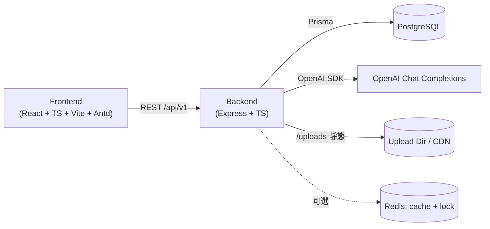
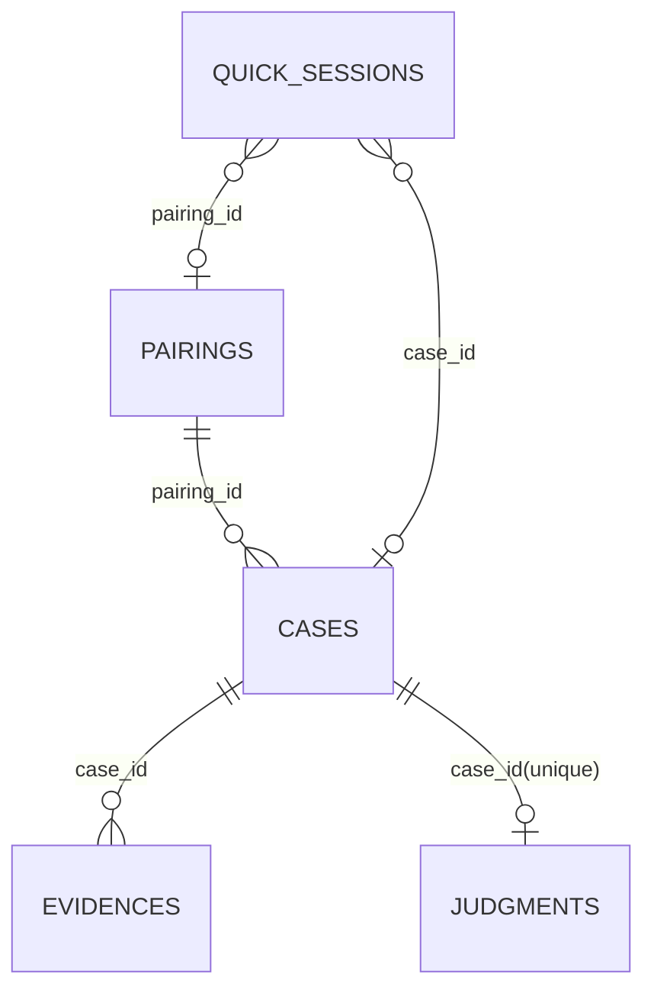
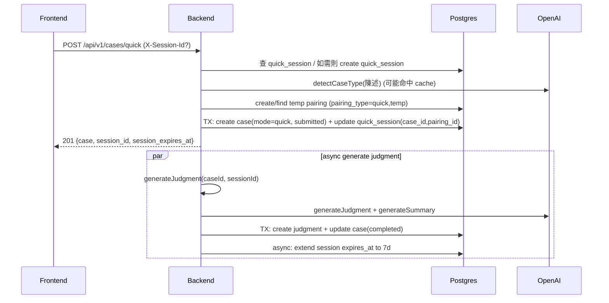

# 快速體驗（Quick Experience）代碼深度梳理與文檔對比報告（2026-02-06）

**Repo**：CJ / 熊媽媽法庭（Mother Bear Court）  
**產出目的**：從「產品規格 → 交互流程 → 前端實作 → 後端實作 → 資料模型 → 權限安全 → 運維與測試」多層面，把「快速體驗」的主/子流程、邏輯細節與邊界條件梳理清楚；並對照既有核心文檔/設計方案，列出不一致處、風險點與改進建議。  
**基準**：以本地代碼庫 `/Users/alex/Desktop/CJ` 於 **2026-02-06** 的狀態為準（文檔與代碼若衝突，以代碼行為為實際）。  

---

## 0. TL;DR（結論先行）

### 快速體驗在做什麼
- 用「**guest Session（quick_sessions）**」作為零門檻授權憑證，讓未註冊用戶完成：**建立 Session → 提交案件 → 後端異步生成 AI 判決 → 前端輪詢展示 → 引導註冊**。
- 快速體驗案件（Case）本質上是 **`mode=quick`** 的 Case，搭配一筆 **`pairing_type=quick, status=temp`** 的臨時配對（Pairing）來滿足資料結構上的 pairing_id 需求。

### 代碼梳理後最重要的「不一致/新問題」
1. **[P0] 簽名媒體 URL 的 token 授權邏輯幾乎必然失敗**：`fileService.signUrl()` 產生的 `payload.f` 形如 `uploads/<file>`，但 `authorizeMedia()` 用 `req.path`（在 `/uploads` mount 下會變成 `/<file>`）去比對，導致 `requestedPath.endsWith(payload.f)` 永遠不成立；使得 ``、`fetch(HEAD)` 等「無法帶 Session Header」的媒體訪問在私有模式下不可用。  
2. **[P0] Session ↔ Case 授權是一對一且會被覆寫**：後端 `createQuickCase` 若同一 Session 已綁定 case_id，會新建 Session；前端收到新 session_id 會覆蓋本地 `mbc_session_id`。結果是：**用戶做第二個快速體驗後，第一個案件可能在 7 天內也無法再訪問**（除非另存 session_id）。  
3. **[P0] 「註冊後自動關聯當前案件/判決」在文檔中多處存在，但代碼未落地且資料/權限設計使其目前不可行**：quick case 的 `plaintiff_id/defendant_id=null`，而完整模式很多權限判斷依賴當事人 id。  
4. **[P1] 證據規則文檔與代碼不一致**：文檔多處寫「**最多 3 張圖片或 1 個視頻**」，但前後端實作是「**最多 3 個文件（image/video 可混）**」，且錯誤訊息仍寫「3張圖片」。  
5. **[P1] `/sessions/refresh` 名稱/語義與實作不一致**：代碼是「永遠新建 Session」，並非續期同一 Session。前端/文檔若用「續期」理解會造成錯誤預期。  
6. **[P1] 後端已提供 `/cases/by-session`（恢復流程），但快速體驗前端未使用**，造成「刷新/中斷後找回案件」缺口。  

---

## 1. 我對本項目的「多層級理解」摘要（用於定位快速體驗）

### 1.1 產品定位（從核心文檔抽象出一致結論）
- 產品：**熊媽媽法庭（Mother Bear Court）**，以「法庭判決」的遊戲化敘事，幫助情侶/伴侶衝突得到「溫暖、公正」的第三方分析與建議。
- 兩個主模式：
  - **快速體驗模式（P0）**：免註冊、零門檻，核心價值是「快速拿到 AI 判決」。
  - **完整模式**：註冊/登錄 + 配對 + 案件管理 + 判決接受/評分 + 和好方案 + 執行追蹤。

### 1.2 技術架構（代碼與文檔一致的總體形狀）



### 1.3 我本次實際閱讀/盤點的核心文件（抽樣清單）
- 項目/開發文檔：`README.md`、`docs/00-項目總覽.md`、`docs/02-產品設計.md`、`docs/10-MVP開發計劃.md`、`docs/QUICK_START.md`、`docs/INTEGRATION.md`、`docs/backend/DEVELOPMENT.md`、`docs/frontend/README.md`
- 快速體驗核心文檔（對照基準）：`docs/快速體驗優化說明.md`、`docs/技術實現細節補充.md`
- 設計文檔：`docs/前端設計/*`、`docs/後端設計/*`（特別是 `03-API設計.md`、`02-數據庫設計.md`、`03-核心頁面詳細設計.md`、`07-交互流程與用戶體驗設計.md`）
- 後端核心代碼（快速體驗相關）：`backend/src/app.ts`、`backend/src/middleware/auth.ts`、`backend/src/routes/session.routes.ts`、`backend/src/routes/case.routes.ts`、`backend/src/routes/judgment.routes.ts`、`backend/src/controllers/*`、`backend/src/services/*`、`backend/prisma/schema.prisma`、`backend/src/jobs/cleanup.job.ts`
- 前端核心代碼（快速體驗相關）：`frontend/src/router/index.tsx`、`frontend/src/services/request.ts`、`frontend/src/store/sessionStore.ts`、`frontend/src/pages/QuickExperience/*`、`frontend/src/services/api/*`、`frontend/src/components/business/FileUpload/*`、`frontend/src/hooks/usePolling.ts`
- 測試：`backend/tests/integration/quick-experience.flow.test.ts`、`frontend/src/pages/QuickExperience/*/*.test.tsx`

---

## 2. 快速體驗的「核心資產」與名詞對齊（代碼視角）

| 名詞 | 代碼/資料對應 | 說明 |
|---|---|---|
| Quick Session | `quick_sessions`（Prisma: `QuickSession`） | guest 授權憑證；前端存於 localStorage `mbc_session_id`；後端以 `X-Session-Id` 或 `?session_id=` 讀取。 |
| Temp Pairing | `pairings`（`pairing_type=quick`, `status=temp`, `session_id=<session>`） | 快速體驗用的「臨時配對」，用來滿足 Case 需要 pairing_id 的資料關係。 |
| Quick Case | `cases`（`mode=quick`, `status=submitted/in_progress/completed/judgment_failed`, `session_id=<session>`） | 快速體驗案件，`plaintiff_id/defendant_id=null`（目前是關鍵限制）。 |
| Judgment | `judgments`（`case_id` unique） | AI 判決結果；包含 markdown 內容、摘要、責任比例、模型/版本。 |
| Evidence | `evidences`（`file_url`, `file_type=image|video`, `file_size`） | 案件證據文件；前端上傳圖片/視頻；後端做魔數驗證 + 壓縮/轉碼；返回簽名 URL。 |
| Media Auth | `/uploads/*` + `authorizeMedia()` | 靜態資源訪問：JWT / session / token 三條路。**目前 token 路徑存在重大不匹配問題（見第 5.6 節）。** |

---

## 3. 資料模型與關係（以 `backend/prisma/schema.prisma` 為準）

### 3.1 主要表（只列快速體驗關鍵字段）

| 模型 | 關鍵字段 | 備註 |
|---|---|---|
| `QuickSession` | `id`、`pairing_id?`、`case_id?`、`expires_at`、`last_accessed_at` | `id` 是 `guest_{timestamp}_{random}`；成功判決後延長至 7 天。 |
| `Pairing` | `id`、`pairing_type`、`status`、`session_id?`、`user1_id?`、`user2_id?` | 快速體驗：`pairing_type=quick`、`status=temp`、`session_id=<guest>`。 |
| `Case` | `id`、`pairing_id`、`mode`、`status`、`session_id?`、`plaintiff_id?`、`defendant_id?`、`type`、`plaintiff_statement`、`defendant_statement?` | 快速體驗：`mode=quick` 且兩個 user id 皆為 null。 |
| `Judgment` | `id`、`case_id (unique)`、`judgment_content`、`summary?`、`plaintiff_ratio`、`defendant_ratio`、`ai_model`、`prompt_version` | DB 有 `judgment_ratio_100` check（比例和為 100）。 |
| `Evidence` | `id`、`case_id`、`user_id?`、`file_url`、`file_type`、`file_size` | 快速體驗：`user_id=null`。 |

### 3.2 關係圖（快速體驗部分）



### 3.3 快速體驗「權限憑證」的本質（非常重要）
- 對 `mode=quick` 的 Case/Judgment/Evidence 來說：**Session ID 等同於訪問權限**（類似 share token / access token）。  
  - 這也是為什麼「覆寫 session_id」會直接造成「舊案件不可訪問」。
- 目前快速體驗沒有「把案件轉正成用戶資產」的流程，因此 quick case 基本上是「憑 Session 才能看」。

---

## 4. API 面（快速體驗相關端點一覽）

> 下表同時整理「後端代碼實際行為」與「前端實際調用」。

| 端點 | 方法 | 用途 | 快速體驗授權 | 典型回應/狀態碼 |
|---|---:|---|---|---|
| `/api/v1/sessions/quick` | POST | 建立 guest Session | 無 | 200 `{session_id, expires_at}` |
| `/api/v1/sessions/refresh` | POST | **實作上=新建 Session** | 無 | 200 `{session_id, expires_at}` |
| `/api/v1/cases/quick` | POST | 建立 quick case（會自動處理 session 缺失/過期） | `X-Session-Id` 或 `?session_id`（可缺省） | 201 `{ case, session_id, session_expires_at? }` |
| `/api/v1/cases/:id` | GET | 取案件詳情（含 evidences/judgment 等） | `X-Session-Id` 或 `?session_id`（必需且需匹配） | 200；不匹配 403；session 過期 401 |
| `/api/v1/cases/by-session` | GET | 用 session 找回案件（恢復流程） | `X-Session-Id` 或 `?session_id`（必需） | 200 / 404 |
| `/api/v1/cases/:id/judgment` | GET | 取判決（輪詢） | `X-Session-Id` 或 `?session_id`（必需且需匹配） | 200；未生成 202（`JUDGMENT_PENDING`） |
| `/api/v1/judgments/generate/:id` | POST | 手動觸發/重試生成判決 | `X-Session-Id` 或 `?session_id`（需匹配） | 200；冷卻/併發 409 |
| `/api/v1/cases/:id/evidence` | POST | 上傳證據（multipart） | `X-Session-Id` 或 `?session_id`（需匹配） | 200 `{ evidences: [...] }` |
| `/api/v1/cases/:id/evidence/:evidenceId` | DELETE | 刪除證據 | `X-Session-Id` 或 `?session_id`（需匹配） | 200 |
| `/uploads/:file` | GET/HEAD | 訪問媒體文件 | JWT / session / token | 200；未授權 401；限流 429 |

---

## 5. 後端深梳理：快速體驗的所有主/子流程

### 5.1 Session：建立、驗證、過期、延長、清理

**代碼入口**
- `backend/src/routes/session.routes.ts`：`POST /sessions/quick`、`POST /sessions/refresh` 都指向 `SessionController.createSession()`
- `backend/src/services/session.service.ts`：`createSession()`、`getSession()`、`markSessionCompleted()`、`cleanupExpiredSessions()`
- `backend/src/utils/session.ts`：`generateSessionId()` / `validateSessionId()`

**行為要點（以代碼為準）**
- Session id 格式：`guest_{timestamp}_{random}`（`validateSessionId` 正則：`/^guest_\d+_[a-z0-9]{8,}$/`）。
- **初始有效期**：24 小時（`createSession` 寫入 `expires_at = now + 24h`）。
- **判決成功後延長**：`JudgmentService.generateJudgment()` 完成後，異步呼叫 `sessionService.markSessionCompleted()`，將 `expires_at` 改為 `now + 7d`。
- **過期處理**：`sessionService.getSession()` 讀到過期會異步 `delete` 該 session，並回傳 null。
- **清理任務**：`backend/src/jobs/cleanup.job.ts` 每小時批量清理過期 sessions。

> ⚠️ 文檔中對 `/sessions/refresh` 的描述常寫成「續期/續命」，但代碼實作是「永遠新建 Session」（見第 9 節對比）。

---

### 5.2 主流程：建立 quick case（`POST /api/v1/cases/quick`）

**代碼入口**
- 路由：`backend/src/routes/case.routes.ts`
- Controller：`backend/src/controllers/case.controller.ts` → `createQuickCase`
- Service：`backend/src/services/case.service.ts` → `createQuickCase`
- 配對：`backend/src/services/pairing.service.ts` → `createTempPairing`
- AI：`backend/src/services/ai.service.ts` → `detectCaseType`

#### 5.2.1 實際處理步驟（逐步對照代碼）

1) **提取 sessionId（不強制）**  
Controller 從 `x-session-id` / `query.session_id` 取出，允許為 null，交由 service 統一處理。

2) **統一 Session 處理：驗證 →（必要時）新建**  
`CaseService.createQuickCase`：
- 缺失/格式不合法 → `sessionService.createSession()`
- 格式合法但 DB 不存在或已過期 → `createSession()`
- DB 存在且未過期 → 直接使用原 sessionId

3) **同一 Session 只允許一個 quick case（重要規則）**  
`CaseService.createQuickCase`：
- 若 `quick_sessions.case_id` 已存在 → **直接新建 Session** 再繼續（等同強制「一 Session 一 Case」）。

4) **驗證輸入**（同時有 Joi 層與 Service 層的二次驗證）
- 原告陳述 min 30 / max 2000（`ValidationUtils.validateStatement(..., 30)`）
- 被告陳述可空；若不空 min 10 / max 2000

5) **AI 類型識別**  
呼叫 `aiService.detectCaseType()`（帶 7 天緩存）。識別失敗則 fallback `其他衝突`。

6) **建立/復用臨時配對**  
`pairingService.createTempPairing(sessionId)`：  
- 先查 `pairings` 是否已有 `session_id=sessionId & pairing_type=quick`，有則復用；無則新建 `status=temp`。
- 有單日上限 `DAILY_LIMIT=5000`（防止表膨脹）。

7) **生成案件標題**  
`generateCaseTitle()` 失敗則 fallback `案件-<日期>`。

8) **交易（transaction）寫入**  
同一個 transaction 內：
- 新建 Case：`mode=quick`、`status=submitted`、`plaintiff_id/defendant_id=null`、`session_id=finalSessionId`、`pairing_id=tempPairing.id`、`submitted_at=now`
-（如果 evidence_urls 直接傳入）建 Evidence（但前端實際不使用這條路徑）
- 更新 QuickSession：寫入 `case_id` + `pairing_id`

9) **Controller 異步觸發判決生成（不阻塞）**  
`this.judgmentService.generateJudgment(caseId, { sessionId })` fire-and-forget。

10) **回應**  
201 返回 `{ case, session_id, session_expires_at }`。

#### 5.2.2 時序圖（後端視角）



---

### 5.3 子流程：判決生成、輪詢、失敗重試

**代碼入口**
- 後端生成服務：`backend/src/services/judgment.service.ts`
- API 觸發：`backend/src/routes/judgment.routes.ts`（手動重試）與 `CaseController.createQuickCase`（自動異步觸發）
- 查詢：`CaseController.getJudgmentByCaseId`（`GET /cases/:id/judgment`）

#### 5.3.1 生成判決的控制策略（可靠性核心）
- **分布式鎖**：`lockService.withLock("judgment:lock:<caseId>", ..., ttl=120s)`，避免同一 case 並發生成。
  - Redis 可選；生產缺 Redis 時預設拒絕（除非 `ALLOW_SIMPLE_LOCK=true`）。
- **允許狀態**：`submitted` / `judgment_failed` / `in_progress`
  - `in_progress` 是崩潰恢復用：若生成中崩潰，下一次調用允許再次嘗試。
- **失敗冷卻**：`judgment_failed` 時會檢查 `updated_at`，未超過 `JUDGMENT_RETRY_COOLDOWN_MS`（默認 60s）則返回 409。
- **超時保護**：AI 生成額外做 `Promise.race`，超時（默認 60s）則標記 `judgment_failed`。
- **資料一致性**：用 transaction 寫入 judgment + 更新 case 完成；並用 `case_id unique` 作最後防線（Prisma P2002 會回查既有判決）。
- **Session 延長**：僅 `mode=quick` 且成功完成後執行 `markSessionCompleted`（延長 7d）。

#### 5.3.2 判決查詢的「pending」語義
- `JudgmentService.getJudgmentByCaseId`：
  - 找不到 judgment → 回傳 `null`
  - Case `status=judgment_failed` → throw `JUDGMENT_FAILED`
- `CaseController.getJudgmentByCaseId`：
  - 若 service 回 `null` → 回 202，且 body 為 `{ success:false, error:{ code:'JUDGMENT_PENDING' } }`

> 這個「202 + success:false」是前端輪詢的關鍵約定。

---

### 5.4 子流程：案件查詢與「恢復」能力（Session 找回）

**代碼入口**
- `GET /api/v1/cases/:id` → `CaseService.getCaseById()`
- `GET /api/v1/cases/by-session` → `CaseService.getCaseBySessionId()`

**快速體驗權限**
- `mode=quick` 時：
  - 必需 `sessionId` 且 `case.session_id === sessionId`
  - 並且追加校驗 session 本身存在且未過期（否則 `SESSION_EXPIRED`）

**恢復接口**
- 後端已提供 `/cases/by-session` + `validateSession` middleware（會更新 `last_accessed_at`）。  
- 但快速體驗前端目前沒有用它做「刷新/中斷後引導回到結果頁」。

---

### 5.5 子流程：證據上傳/刪除（含文件處理）

**代碼入口**
- `backend/src/controllers/evidence.controller.ts`
- `backend/src/services/file.service.ts`

**規則（代碼實際）**
- 上傳 endpoint：`POST /api/v1/cases/:id/evidence`，FormData 欄位名為 **`files`**，可多檔（multer `upload.array('files', 3)`）。
- 允許案件狀態：`draft` / `submitted` / `in_progress`（完成後不允許）。
- **數量限制（實際）**：最多 3 個文件（image/video 混合也算）。  
  - 錯誤訊息仍寫「最多只能上傳3張圖片」，與實際規則不一致。
- 支援類型：JPG/JPEG/PNG/GIF/MP4  
  - `validateFile()` 會做：大小限制、MIME/副檔名校驗、**魔數驗證**（File Signature）。
- 圖片處理：旋轉（EXIF）+ 最大 1920 邊界 resize + 轉 JPEG（80 品質）。
- 視頻處理：ffmpeg 轉碼 mp4 + 720p 上限 + `+faststart`。
- 回傳：`data.evidences` 陣列，內含 `file_url`（已做 `signUrl`）。

---

### 5.6 子流程：`/uploads` 媒體訪問授權（P0 新發現）

**代碼入口**
- 掛載：`backend/src/app.ts` 中 `app.use('/uploads', ...)`
- 授權：`backend/src/middleware/auth.ts` → `authorizeMedia()`
- 簽名：`backend/src/services/file.service.ts` → `signUrl()`

#### 5.6.1 設計意圖（代碼註釋）
`authorizeMedia` 規則：
1) 若已有 JWT（`req.user.id`）→ 允許  
2) 否則若有 quick session（`X-Session-Id` 或 `?session_id`）→ 允許  
3) 否則若有簽名 `token`（`?token=`，JWT payload 內含 file path hash）→ 允許  
4) 都沒有 → 401

#### 5.6.2 為什麼 token 授權幾乎必然失敗（根因）
- `fileService.signUrl(url)` 會把 `payload.f` 設成：
  - `filename = parsed.pathname.replace(/^\/+/, '')`
  - 對本地 `/uploads/<file>` 形式的 URL，`filename` 會是 **`uploads/<file>`**
- 但 Express 在 `app.use('/uploads', middleware...)` 的 middleware 內部：
  - `req.baseUrl === '/uploads'`
  - `req.path === '/<file>'`（**不包含 `/uploads` 前綴**）
- `authorizeMedia()` 目前用 `req.path` 做 `requestedPath`，因此 `requestedPath` 會是 **`<file>`**  
  → 造成 `requestedPath.endsWith(payload.f)` 變成：`<file>.endsWith('uploads/<file>')`，永遠是 false。

#### 5.6.3 我做的最小可重現（確認 Express 行為）
我以一個最小 Express app 驗證 mount path 之下的 request path 形態，輸出如下：

```
baseUrl: /uploads
url: /foo.jpg?token=abc
path: /foo.jpg
originalUrl: /uploads/foo.jpg?token=abc
```

**結論**：在 `/uploads` mount 下，`req.path` 不含 `/uploads`，必須用 `req.baseUrl + req.path` 或 `req.originalUrl` 才能得到完整相對路徑。

#### 5.6.4 影響面（為什麼這是 P0）
- 任何「**無法帶 Header**」的媒體訪問都依賴 token，例如：
  - ``
  - `<video src="signedUrlWithToken">`
  - `FileUpload` 的 `fetch(url, { method: 'HEAD' })`（用來檢查簽名是否過期）
- 在 `ALLOW_PUBLIC_UPLOADS !== 'true'` 且未使用外部 CDN 繞過授權時，**媒體預覽/縮圖/新視窗預覽可能全部不可用**。

#### 5.6.5 建議修正方向（不在本報告直接改碼，僅給方案）
**方案A（最小改動）**：在 `authorizeMedia()` 中把 requestedPath 改為 mount-aware 的相對路徑：
- `requestedPath = (req.baseUrl + req.path).replace(/^\/+/, '')`
  - 如此 `/uploads/foo.jpg` → `uploads/foo.jpg`，可與 `payload.f` 對齊

**方案B（統一路徑語義）**：讓 `signUrl()` 只簽檔名（basename）而非 `uploads/<file>`，並在 `authorizeMedia` 以 basename 對比（需評估風險與既有 token 兼容）。

另外建議補一個單元測試（或最小 integration test）覆蓋：
- `signUrl()` 產生的 token 能成功訪問 `/uploads/<file>?token=...`（GET/HEAD）

---

## 6. 前端深梳理：快速體驗的所有主/子流程

### 6.1 路由結構（實作）
- `frontend/src/router/index.tsx`
  - `/quick-experience`：直接 `Navigate` 到 `/quick-experience/create`
  - `/quick-experience/create`：創建案件頁
  - `/quick-experience/result/:id`：結果頁

> 設計文檔中曾提及 `pages/QuickExperience/Index` 作為入口頁，但當前實作是「入口路由 redirect」。

---

### 6.2 Session 狀態與請求層（全局行為，影響所有 quick API）

**代碼入口**
- `frontend/src/utils/storage.ts`：`sessionStorage`（localStorage key：`mbc_session_id`）
- `frontend/src/store/sessionStore.ts`：Zustand persist（localStorage key：`session-storage`）
- `frontend/src/services/request.ts`：Axios instance + interceptors

#### 6.2.1 Session 寫入與讀取的「雙軌」
- sessionId：`localStorage.mbc_session_id`（`sessionStorage.get/set/remove`）
- session 詳情：`localStorage.session-storage`（Zustand persist 的 `session` object）

這讓前端在多處會寫入/覆蓋 session，若策略不嚴謹容易造成「舊 session 權限丟失」。

#### 6.2.2 Axios request interceptor：同時寫 header + query（安全/一致性風險）
`frontend/src/services/request.ts`：
- 若有 token → `Authorization: Bearer <token>`
- 若有 sessionId：
  - 寫入 `X-Session-Id: <sessionId>`
  - **同時把 `session_id` 注入 query params**

> 這種「全局自動把 session_id 放 query」的做法，會讓 session 進入 URL（更容易被 server access log、代理層、甚至第三方監控記錄），也可能在某些情況下經由 `Referer` 外洩。建議至少把範圍縮小到必要端點（或只用 header）。

#### 6.2.3 Axios response interceptor：401 Session 錯誤會自動換發新 Session
`frontend/src/services/request.ts` 對 401 且錯誤碼為：
- `SESSION_EXPIRED` / `SESSION_ID_REQUIRED` / `INVALID_SESSION_ID`

會：
1) `useSessionStore.clearSession()`（清 `mbc_session_id`）
2) `useSessionStore.refreshSession(true)`（呼叫 `/sessions/refresh` → **新建 session**）
3) 顯示 warning：請重新開始/重新發起操作

這與「不要覆蓋舊 session 避免舊案件不可訪問」的產品目標方向一致，但仍需注意：
- **一旦自動換發新 session，舊 case 的 session 授權就不可逆丟失**（除非另存映射）。

---

### 6.3 主流程：Create 頁（`/quick-experience/create`）

**代碼入口**
- `frontend/src/pages/QuickExperience/Create/index.tsx`
- 依賴：`useSessionStore` / `useCaseStore` / `createQuickCase` / `uploadEvidence`

#### 6.3.1 頁面初始化
- 僅在 Create 頁主動確保 session：
  - 若 `mbc_session_id` 不存在，才會 `createSession()`。
- 草稿 autosave：
  - 每 30 秒把 `plaintiffStatement/defendantStatement` 存到 `localStorage.quick_case_draft`
  - 證據文件不恢復（需要重新上傳）

#### 6.3.2 輸入與驗證規則（前端）
- 角色A：必填，>= 30 字（`validateStatement`）
- 角色B：可留空；若不空需 >= 10 字
- UI：完成度進度條；模板文字；「自動代寫角色B」只是前端拼接文本，不調用後端 AI。

#### 6.3.3 提交流程（含證據子流程）
1) 確保 session（若沒有就 create）
2) `POST /cases/quick` 建 case
3) 若後端回傳 `session_id`：
   - 覆寫 `mbc_session_id`
   - 若同時回傳 `session_expires_at`，同步更新 `useSessionStore.session`
4) 若有選擇證據文件：
   - `POST /cases/:id/evidence` 上傳（使用 `result.session_id` 優先）
   - 上傳失敗不阻塞主流程：只寫 `localStorage.pending_evidence_<caseId>=true` 供結果頁補傳
5) 清草稿，跳轉 `/quick-experience/result/:id`

---

### 6.4 主流程：Result 頁（`/quick-experience/result/:id`）

**代碼入口**
- `frontend/src/pages/QuickExperience/Result/index.tsx`
- 依賴：`getJudgmentByCaseId`、`usePolling`、`getCase`、`uploadEvidence`

#### 6.4.1 判決獲取與輪詢策略
- 首次進入會先 `fetchJudgment()`
- 若尚未生成：
  - 後端回 202（`JUDGMENT_PENDING`）→ 前端視為正常 pending（回傳 null）
  - 啟動 `usePolling`：
    - 初始 5 秒
    - 指數退避（*1.5）上限 30 秒
    - 最多 30 次或 5 分鐘
- 若 case status 為 `judgment_failed` 或返回 `JUDGMENT_FAILED`：
  - 顯示「重試生成」按鈕 → `POST /judgments/generate/:id`

#### 6.4.2 證據補傳（結果頁子流程）
- 會額外 `getCase(id)` 取得 case.status 與 evidences：
  - 若狀態不在 `draft/submitted/in_progress`，移除 pending flag，且不再顯示補傳區
  - 若 evidences 已存在 → 顯示成功
  - 若 `pending_evidence_<caseId>` 存在 → 顯示 pending/failed 引導用戶補傳
- 補傳 UI（`EvidenceUploadSection`）不限制 maxCount，完全依賴後端限制（multer=3 + count 檢查）

#### 6.4.3 後續操作
- 目前只有：
  - 「立即註冊」
  - 「再創建一個」（回 Create 頁）
- 設計文檔中的「保存記錄/分享/語音播放/生成和好方案」等操作未在 quick result 實作。

---

### 6.5 恢復流程缺口（前端未落地）
- 前端服務層已有 `getCaseBySessionId(sessionId)`（調 `/cases/by-session`），但 QuickExperience Create/Result 未使用。
- 因此若用戶：
  - 刷新後丟了 URL
  - 或離開後回來只剩 session
  
目前缺少「自動找回最近 quick case 並跳結果頁」的體驗閉環。

---

## 7. AI 成本與配額（快速體驗真實消耗）

**代碼入口**：`backend/src/services/ai.service.ts`

### 7.1 一次 quick case 大約幾次 OpenAI 調用？
在「未命中 cache」的情況下，`POST /cases/quick` + 異步判決生成通常包含：
1) `detectCaseType()` → 1 次 `generateText()`  
2) `generateJudgment()` → 1 次 `generateText()`  
3) `generateSummary()` → 1 次 `generateText()`  

合計：**約 3 次 OpenAI Chat Completions**（detectCaseType 若命中 7 天 cache 可降為 2 次）。

### 7.2 配額控制機制（代碼）
- `OPENAI_DAILY_LIMIT`：用 cache 記 `ai:daily:count:<YYYY-MM-DD>`，用 lock 保證遞增原子性。
- `generateText()` 失敗後會嘗試把 count - 1（避免配額計數漂移）。
- `generateJudgment()` 若 AI 已用但後續失敗，也會再回補一次 count（雙保險）。

**風險提示**
- `/cases/quick` 本身只走 `generalLimiter`，但內部會觸發 detectCaseType（AI 調用），與「AI 限流」並未同路徑對齊。
- 判決生成異步觸發不經過 `aiLimiter`（因為不是 HTTP route），主要靠 daily limit 抵禦成本爆炸。

---

## 8. 測試現況與缺口（快速體驗）

### 8.1 後端
- 有整合測試：`backend/tests/integration/quick-experience.flow.test.ts`
  - 需 DB 可用 + `RUN_FLOW_TESTS=true`
  - Mock AI service
  - 覆蓋：Session 建立、無 session 自動創建、輪詢判決、不同陳述、部分異常場景

**缺口（建議）**
- 缺少 `/uploads` 的 token 授權測試（目前 P0 問題也因此未被測到）。
- 缺少「一個 session 並發 createQuickCase」的競態測試（可能生成多個 case 並覆寫 session.case_id）。

### 8.2 前端
- QuickExperience 的單元測試偏輕量：Create/Result 主要是「能 mount 不崩潰」級別。
- 目前沒有覆蓋：
  - 輪詢超時 UI
  - session 覆寫導致舊案件不可訪問的行為
  - 證據補傳 + 後端限制錯誤提示

---

## 9. 原核心文檔/設計方案 vs 代碼：逐項對比（重點差異表）

> 「文檔定位」欄位僅列文件路徑與關鍵段落主題；更細的行號可後續再補。

| 主題 | 文檔定位 | 文檔/設計描述 | 代碼實際行為 | 差異/影響 |
|---|---|---|---|---|
| 證據數量規則 | `docs/02-產品設計.md`（案件創建/證據管理）、`docs/10-MVP開發計劃.md`、`docs/前端設計/03-核心頁面詳細設計.md`、`docs/後端設計/03-API設計.md` | 「最多 3 張圖片或 1 個視頻」 | 前後端都是「最多 3 個文件（image/video 混合）」；錯誤訊息仍寫「3張圖片」 | 規格/驗收口徑不一致；產品預期與實際不同 |
| 證據上傳 API（參數/回應） | `docs/後端設計/03-API設計.md` | FormData 欄位 `file`；回傳 `data.evidence` | 實作是 `files`（array）+ 回傳 `data.evidences[]` | 文檔不可直接用於對接；容易造成前端/三方誤接 |
| `/sessions/refresh` 語義 | `docs/技術實現細節補充.md`、`docs/frontend/README.md` | 「續期或重建」或「自動續期」 | 直接呼叫 `createSession()`，永遠「新建」 | 若前端把它當「續期同一 session」，會誤導並造成權限丟失 |
| Session 不覆蓋舊案件 | `docs/快速體驗優化說明.md` | 避免誤刷新造成舊案件不可訪問 | 後端強制一 session 一 case，且會回傳新 session_id；前端會覆寫本地 session_id | 使用者做第二次 quick case 後，第一個案件可能直接失訪 |
| 註冊後自動關聯當前案件 | `docs/02-產品設計.md`、`docs/10-MVP開發計劃.md`、`docs/前端設計/07-交互流程與用戶體驗設計.md` | 註冊成功後自動關聯當前判決/案件，並提示保存成功 | 目前無「claim/轉正」API；quick case 的 `plaintiff_id/defendant_id=null` 也使完整模式權限與功能無法直接沿用 | 影響轉化承諾；文案與功能可能不實 |
| 快速體驗結果頁功能按鈕 | `docs/前端設計/07-交互流程與用戶體驗設計.md` | 保存記錄/分享/語音播放/生成和好方案等 | 實作只有「立即註冊」與「再創建一個」 | 設計稿與實際體驗差距大；需更新設計或補功能 |
| 恢復流程（用 session 找回案件） | 後端存在 `/cases/by-session`；整合測試亦覆蓋 | 預期支援中斷後找回 | 前端 QuickExperience 未使用 `getCaseBySessionId` | 用戶刷新/離開回來容易迷失；不利留存 |
| 上傳資源授權（簽名 URL） | `docs/frontend/README.md`（提到簽名過期自動換簽） | 預期 token 可用，必要時可重新換簽 | **P0：authorizeMedia 使用 req.path 導致 token 比對失效** | 媒體預覽/縮圖/換簽機制在私有模式下不可用 |
| DB 層規則（快速模式防重/證據規則） | `docs/後端設計/02-數據庫設計.md` | 提到 `ux_cases_quick_session`、觸發器限制「≤3 圖或 1 視頻」 | migration 未見對應 unique/trigger；主要靠應用層檢查 | 缺少 DB 兜底；並發時可能出現不一致資料 |

---

## 10. 問題清單（P0/P1/P2）與具體建議

### P0（必修：會直接影響核心可用性/安全）

1) **簽名媒體 URL token 授權路徑不匹配（幾乎必失敗）**  
   - 根因：`authorizeMedia` 以 `req.path` 生成 requestedPath，但 `signUrl` 的 `payload.f` 帶 `uploads/` 前綴；Express mount 下 `req.path` 不含 `/uploads`。  
   - 影響：證據/頭像等媒體在私有模式下無法正常展示或預覽；`FileUpload` 的 HEAD 探測與「換簽」形同無效。  
   - 建議：調整 `authorizeMedia` 的 requestedPath 以包含 `req.baseUrl`；並補測試覆蓋 `/uploads/<file>?token=` 可訪問。  
   - 相關代碼：`backend/src/middleware/auth.ts`、`backend/src/services/file.service.ts`、`backend/src/app.ts`

2) **Session 覆寫導致舊 quick case 失訪（session 作為權限 token 的設計後果）**  
   - 根因：後端強制一 session 一 case；新 case 會新建 session 並回傳；前端覆寫 `mbc_session_id`。  
   - 影響：用戶在 7 天延長期內仍可能看不到之前的判決；破壞「回訪」價值。  
   - 建議（需產品決策）：  
     - 方案A：前端保存 `caseId -> sessionId` 映射（localStorage），結果頁訪問時用對應 sessionId；  
     - 方案B：後端提供「一次性 case access token」放 URL（避免依賴全局 session）；  
     - 方案C：允許一個 session 對多個 case（並提供 case 列表/最近一次），但要重做權限與資料模型語義。  
   - 相關代碼：`backend/src/services/case.service.ts`、`frontend/src/services/request.ts`、`frontend/src/store/sessionStore.ts`

3) **「註冊後自動關聯當前案件/判決」未落地且現行模型阻擋**  
   - 根因：quick case 沒有當事人 id；完整模式權限判斷依賴 `plaintiff_id/defendant_id`；缺少 claim/轉正 API。  
   - 影響：註冊引導文案容易承諾過度；轉化後發現不能保存/看歷史會造成負面體驗。  
   - 建議：明確產品策略（二選一）：  
     - 若要落地：設計「claim quick case」流程（以 session 驗證 + 登錄 user），把 case/pairing 轉成可歸屬用戶的資產；  
     - 若不落地：更新文檔與 UI 文案，將 quick case 定位為「不保存」的試用體驗。  
   - 相關文檔：`docs/02-產品設計.md`、`docs/10-MVP開發計劃.md`、`docs/前端設計/07-交互流程與用戶體驗設計.md`

---

### P1（高優：規格不一致/體驗缺口/潛在風險）

1) **證據規則統一（3圖或1影 vs 3檔混合）**  
   - 建議先決策「產品規格到底是哪個」，然後：  
     - 後端：在 evidence upload 檢查 video 與 image 的互斥與數量；修正文案與錯誤碼；  
     - 前端：落地 `MAX_VIDEO_COUNT=1` 且與 `MAX_IMAGE_COUNT=3` 的互斥校驗；結果頁補傳也要限制；  
     - 文檔：同步更新所有提到規則的文件，避免多版本口徑。  

2) **`/sessions/refresh` 命名與語義需對齊**  
   - 若要「續期同一 session」：需後端新增延長 expires_at 的接口（且要有安全限制）；  
   - 若保持「新建」：建議改名（如 `/sessions/new`），並在前端提示「將開始新的體驗、舊案件需用原 session 才能訪問」。  

3) **恢復流程（/cases/by-session）未被前端使用**  
   - 建議在 Create 頁或 QuickExperience 入口做：  
     - 若已有 sessionId，先調 `/cases/by-session` 找最近 quick case，提示「繼續查看上次判決」或「開始新案件」。  

4) **缺少 DB 兜底約束/鎖（並發 createQuickCase 競態）**  
   - 當兩個並發請求同時使用同一 session 且 session.case_id 尚未寫入時，可能生成多個 case 並最後覆寫 quick_session.case_id。  
   - 建議：對 quick_session 行做 `SELECT ... FOR UPDATE` 或在 transaction 中做更強一致性處理；或加 DB unique/約束做最後防線。  

---

### P2（中低優：一致性/可觀測性/工程質量）

- `authorizeMedia` 的成功路徑中，session 方式未更新 `last_accessed_at`（只在 `validateSession` middleware 更新），是否要統一？  
- 後端 error log 目前只記 `req.sessionId`（需 middleware 設置），而多數 controller 只是局部變量取 session；可考慮在解析後寫回 `req.sessionId` 以利排查。  
- 整合測試 fixtures 中的 evidence file types（如 pdf）與實作不一致，建議清理以免誤導。  

---

## 11. 開放問題（需要產品/技術共同決策）

1) 快速體驗的「資產歸屬」策略：  
   - quick case 是否應可被註冊後「保存進歷史」？若是，保存到哪個 pairing/當事人如何定義？

2) Session 的角色定位：  
   - 是「短期授權 token」？還是「用戶的匿名帳號」？  
   - 若要支援「多案件回訪」，是否需要 case-level token 或 session-to-cases 索引？

3) 媒體文件的安全策略：  
   - 若生產使用 CDN，token/授權要在 CDN 層做還是回源到後端做？  
   - 目前 `signUrl()` 對 CDN URL 加 token 並不會被 CDN 驗證（除非 CDN 有相應能力/配置）。

---

## 附錄 A：快速體驗相關核心代碼導航（建議閱讀順序）

1) 後端路由 → controller  
   - `backend/src/routes/session.routes.ts`  
   - `backend/src/routes/case.routes.ts`  
   - `backend/src/routes/judgment.routes.ts`  
   - `backend/src/controllers/session.controller.ts`  
   - `backend/src/controllers/case.controller.ts`  
   - `backend/src/controllers/evidence.controller.ts`  

2) 後端 service（真正邏輯）  
   - `backend/src/services/session.service.ts`  
   - `backend/src/services/case.service.ts`  
   - `backend/src/services/judgment.service.ts`  
   - `backend/src/services/ai.service.ts`  
   - `backend/src/services/file.service.ts`  
   - `backend/src/services/pairing.service.ts`  

3) 後端權限/靜態資源  
   - `backend/src/middleware/auth.ts`（`validateSession` / `authorizeMedia`）  
   - `backend/src/app.ts`（`/uploads` mount）  

4) 前端主流程  
   - `frontend/src/pages/QuickExperience/Create/index.tsx`  
   - `frontend/src/pages/QuickExperience/Result/index.tsx`  
   - `frontend/src/services/request.ts`（session 注入/錯誤處理）  
   - `frontend/src/store/sessionStore.ts`  
   - `frontend/src/services/api/session.ts` / `case.ts` / `judgment.ts`  

5) 測試  
   - `backend/tests/integration/quick-experience.flow.test.ts`  

---

## 附錄 B：快速體驗原核心文檔/設計方案（本報告對比來源）

- `docs/快速體驗優化說明.md`  
- `docs/技術實現細節補充.md`  
- `docs/02-產品設計.md`  
- `docs/10-MVP開發計劃.md`  
- `docs/前端設計/03-核心頁面詳細設計.md`  
- `docs/前端設計/07-交互流程與用戶體驗設計.md`  
- `docs/後端設計/03-API設計.md`  
- `docs/後端設計/02-數據庫設計.md`  

