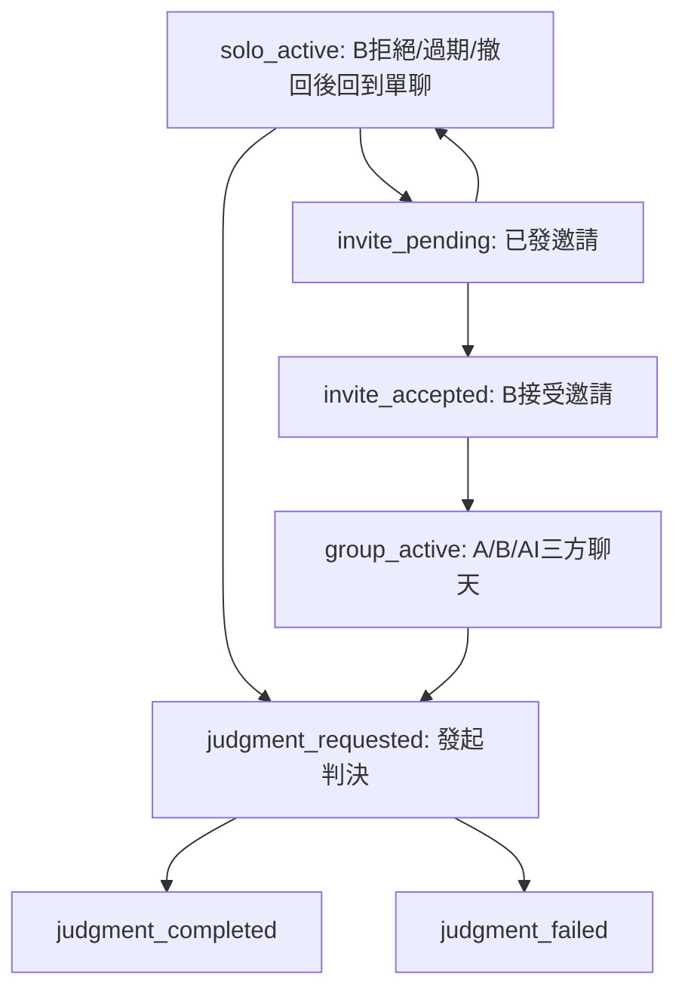

# 單聊轉群聊再判決 v1 設計方案

## 1. 目標與範圍

在既有能力上建立一條可落地的新流程：

`A+AI 單聊（訴苦/吐槽）` -> `邀請 B 入房` -> `A/B/AI 三方聊天` -> `隨時發起判決（沿用正式案件流程）`

本方案僅定義 v1 規格，不包含代碼改動與 DB migration。

補充：本文後半（§9）包含「目前實作進度」與「已落地修正/測試」的對齊紀錄，作為 as-built 參考。

### 1.1 設計原則

- 優先「情緒承接」再進入「問題分析」
- 聊天與判決分層，避免所有輸入直接等價於案件事實
- 先有房間權限與可見性邊界，再談群聊體驗
- 轉判決時優先安全分流（危機/暴力訊號）

---

## 2. 流程、角色、狀態與權限邊界

### 2.1 角色定義

- `roleA`：發起者（可先單聊）
- `roleB`：受邀加入者
- `aiMediator`：陪伴/重述/降溫/結構化提取，不替代法律裁決

### 2.2 流程狀態機（v1）

### 2.3 權限邊界（v1 預設）

- 房主預設為 `roleA`
- `roleA` 可發邀請、可取消邀請、可發起判決
- `roleB` 加入後可發言、可建議發起判決，但無法修改 A/B 歷史可見策略
- `aiMediator` 不可改權限，只能讀可見消息並輸出輔助訊息

### 2.4 歷史可見性規則（關鍵）

- `roleB` 加入前，`roleA` 預設可選：
  - `share_full_history`
  - `share_summary_only`（預設建議）
  - `share_from_join_time`
- 若選擇摘要共享，系統需生成「中立摘要」供 B 入房時顯示

---

## 3. 資料模型草圖（不落地）

> 目標是最小可用，盡量與既有 `cases` / `judgments` 低耦合整合。

### 3.1 新增表（草圖）

1. `chat_rooms`
- `id`
- `status` (`solo_active` / `invite_pending` / `group_active` / ...)
- `owner_user_id`（A）
- `session_id`（未登入場景）
- `history_visibility_mode`（B入房歷史可見策略）
- `created_at` / `updated_at`

2. `chat_participants`
- `id`
- `room_id`
- `participant_type` (`user` / `ai`)
- `user_id`（nullable，未登入可空）
- `role_in_room` (`roleA` / `roleB` / `aiMediator`)
- `joined_at` / `left_at`

3. `chat_messages`
- `id`
- `room_id`
- `sender_participant_id`
- `content`
- `message_type` (`user_text` / `ai_reflection` / `ai_summary` / `system_event`)
- `visibility_scope` (`all` / `owner_only` / `summary_only`)
- `safety_flag` / `safety_detail`
- `created_at`

4. `chat_invites`
- `id`
- `room_id`
- `invite_code` 或 `invite_token`
- `invited_user_id`（可空）
- `status` (`pending` / `accepted` / `declined` / `expired`)
- `expires_at` / `created_at`

5. `chat_to_case_links`
- `id`
- `room_id`
- `case_id`
- `triggered_by` (`roleA` / `roleB` / `system`)
- `conversion_snapshot`（轉換時的輸入摘要）
- `created_at`

### 3.2 與既有資料的關聯

- `chat_to_case_links.case_id` 關聯既有 `cases.id`
- 判決仍由既有 `judgmentService.generateJudgment(caseId)` 處理
- 保留 `InterviewSession` 作為心理畫像獨立管線，不與聊天室硬綁

---

## 4. MVP API 草圖

> 以下為責任拆分，不限定 REST/GraphQL 實作型式；先以現有 REST 風格為主。

### 4.1 房間與邀請

- `POST /api/v1/chat/rooms`
  - 建立單聊房（A + AI）
- `GET /api/v1/chat/rooms/:roomId`
  - 讀取房間與狀態
- `POST /api/v1/chat/rooms/:roomId/invites`
  - 建立邀請（可帶可見性策略）
- `POST /api/v1/chat/invites/:inviteCode/accept`
  - B 接受邀請入房（invite 以 code 作為主要輸入）
- `POST /api/v1/chat/invites/:inviteCode/decline`
  - B 拒絕邀請（公開邀請僅房主可撤回，避免第三方惡意 decline）

### 4.2 訊息與同步

- `GET /api/v1/chat/rooms/:roomId/messages?cursor=...`
  - 分頁拉歷史
- `POST /api/v1/chat/rooms/:roomId/messages`
  - A/B 發訊息
- `GET /api/v1/chat/rooms/:roomId/stream`
  - SSE 廣播（房間級事件）

補充：
- AI 回覆採「後端自動編排」：使用者發送公開訊息後，`ChatAIOrchestrator` 會依狀態/安全/節流決定是否插話（無公開 `ai-reply` 端點）
- 房級限流：5 秒最多 1 則，30 秒滑窗最多 6 則（超限 429）

### 4.3 轉判決

- `POST /api/v1/chat/rooms/:roomId/request-judgment`
  - 將房間對話轉換為案件輸入
  - 建立 `case`（`mode` 建議為 `collaborative` 或新 `chat_assisted`）
  - 調用既有判決流程
  - 可選 body：`{ included_message_ids?: string[] }`（手動指定納入訊息子集合；若提供則需至少 1 則）
- `GET /api/v1/chat/rooms/:roomId/judgment-status`
  - 查詢判決生成狀態與結果連結

### 4.4 參與者離房（v1 補強）

- `POST /api/v1/chat/rooms/:roomId/leave`
  - B 自離（更新 left_at/is_active=false）
- `POST /api/v1/chat/rooms/:roomId/kick-b`
  - A 移除 B（房主操作）

---

## 5. 聊天室歷史 -> 判決輸入轉換規則

### 5.1 訊息分層提取

- `emotionLayer`：情緒宣洩、受傷語句、需求語句
- `factLayer`：可時間定位、可觀察事件描述
- `interactionLayer`：A/B 互動循環（追逃、批評-防衛等）

### 5.2 角色歸屬

- A/B 訊息分別彙整為：
  - `plaintiff_statement_candidate`
  - `defendant_statement_candidate`
- AI 訊息不直接當事實，只作結構提示與補充上下文

### 5.3 可用性與缺口標記

- 若 B 未加入或訊息不足，標記 `defendant_missing=true`
- 若事實衝突高，標記 `high_conflict=true` 並要求判決階段更高不確定性語氣

### 5.4 安全分流（必須先於判決）

- 若命中危機/暴力信號：
  - `route = crisis_support | safety_support`
  - 禁止輸出對稱責任框架
  - 先輸出安全建議，再決定是否允許進入正式判決

### 5.5 轉換產物（建議）

- `conversion_snapshot` 包含：
  - A 摘要、B 摘要、核心爭點、觸發模式、缺口標記、安全標記
- 存在 `chat_to_case_links` 供稽核與回溯

---

## 6. 治理規則與產品邊界

### 6.1 隱私與透明

- B 入房前必須明示歷史可見範圍
- A 單聊中敏感內容允許標記為「不共享」
- 轉判決前顯示「即將納入判決的訊息摘要」供確認

### 6.2 AI 話語邊界

- AI 不使用「法院裁定」口吻
- AI 不在群聊直接下最終責任定論
- AI 在危機場景優先做安全支持與降溫

### 6.3 判決觸發權限（v1 預設）

- `roleA` 可發起
- `roleB` 可請求但需 A 確認（降低惡意觸發）
- v1.1 可擴展為雙方同意模式開關

---

## 7. 驗收標準與追蹤指標

### 7.1 功能驗收

- A 可完成單聊並收到 AI 承接
- A 可成功邀請 B，B 可按策略加入並看到對應歷史
- A/B/AI 可在同一房間互動
- 任一時點可發起判決並成功連到既有判決流程

### 7.2 安全與風險驗收

- 高風險訊號可正確分流，不進一般責任框架
- 歷史可見策略可被正確執行
- 轉判決摘要可回看、可追蹤

### 7.3 成效指標（建議）

- `conversationToJudgmentRate`
- `inviteAcceptanceRate`
- `judgmentAfterGroupChatSuccessRate`
- `feltUnderstoodAvg` / `feltBlamedAvg` / `willingToTryAvg`
- `safetyEscalationRate`

---

## 8. 與現有能力映射（可重用）

- 單聊能力：`InterviewService` + SSE
- 邀請能力：`PairingService` 邀請碼與加入流程（可借鏡）
- 判決能力：`JudgmentService` 現有主流程（含安全路由）
- 需要新增：房間模型、群聊消息流、聊天室轉判決轉換器

參考實作：
- `/Users/alex/Desktop/CJ/mother-bear-court/frontend/src/router/index.tsx`
- `/Users/alex/Desktop/CJ/mother-bear-court/backend/src/services/interview.service.ts`
- `/Users/alex/Desktop/CJ/mother-bear-court/backend/src/services/judgment.service.ts`
- `/Users/alex/Desktop/CJ/mother-bear-court/backend/src/services/case.service.ts`
- `/Users/alex/Desktop/CJ/mother-bear-court/backend/prisma/schema.prisma`

---

## 9. 目前實作進度（對齊 v1）

以下項目已完成後端落地（MVP）：

- Prisma 模型已新增：
  - `chat_rooms`
  - `chat_participants`
  - `chat_messages`
  - `chat_invites`
  - `chat_to_case_links`
- Prisma migrations（聊天室相關）：
  - `backend/prisma/migrations/20260225120000_add_chat_v1_models`
  - `backend/prisma/migrations/20260226230000_chat_active_roleb_unique`
  - `backend/prisma/migrations/20260227081000_chat_active_roles_unique`
  - `backend/prisma/migrations/20260301090000_chat_ai_reply_fields`
- 新增聊天室服務與路由：
  - `backend/src/services/chat.service.ts`
  - `backend/src/services/chat-events.service.ts`
  - `backend/src/services/chat-ai-orchestrator.service.ts`
  - `backend/src/services/chat-metrics.service.ts`
  - `backend/src/routes/chat.routes.ts`
  - `backend/src/routes/metrics.routes.ts`（`GET /metrics`）
- 已接入主應用路由：
  - `backend/src/app.ts` (`/api/v1/chat`)
- 已支持核心 API：
  - `POST /api/v1/chat/rooms`
  - `GET /api/v1/chat/rooms/:roomId`
  - `POST /api/v1/chat/rooms/:roomId/invites`
  - `POST /api/v1/chat/invites/:inviteCode/accept`
  - `POST /api/v1/chat/invites/:inviteCode/decline`
  - `GET /api/v1/chat/rooms/:roomId/messages`
  - `POST /api/v1/chat/rooms/:roomId/messages`
  - `GET /api/v1/chat/rooms/:roomId/stream`（SSE）
  - `POST /api/v1/chat/rooms/:roomId/request-judgment`（支援 `included_message_ids`）
  - `GET /api/v1/chat/rooms/:roomId/judgment-status`
  - `POST /api/v1/chat/rooms/:roomId/leave`
  - `POST /api/v1/chat/rooms/:roomId/kick-b`
- 已暴露 Prometheus metrics：
  - `GET /metrics`（Chat counters）
  - 告警規則示例：`backend/ops/prometheus/chat-alerts.rules.yml`（說明見 `backend/docs/ALERTS_CHAT.md`）
- 已支持聊天室轉判決串接：
  - 從 `chat_messages` 提取 A/B 陳述
  - 建立 `cases`（按登入/匿名場景映射 mode）
  - 調用既有 `JudgmentService.generateJudgment`
  - 生成 `chat_to_case_links` 並回寫 `judgment_id`
  - 同步更新聊天室狀態為 `judgment_requested/completed/failed`
  - 轉換快照已包含：`emotion_highlights` / `fact_highlights` / `information_gaps` / `transform_confidence`
  - 前置安全分流：
    - `crisis_support`：中止一般判決並先輸出 `safety_notice`
    - `safety_support`：保留判決流程，但先輸出安全提示並寫入快照
  - 冪等保護：
    - `judgment_completed` 後短時間內重複觸發，返回既有 `chat_to_case_link`，避免重複建案
- 已完成審核修正（避免偏離設計）：
  - **歷史可見性收斂**：`share_from_join_time` 嚴格限制 B 僅看加入後訊息
  - **判決並發保護**：新增房間級鎖，避免重複觸發生成多個 case
  - **權限邊界對齊**：v1 先限定 A 可發起判決（避免 B 未經確認直接觸發）
  - **前置安全分流**：轉判決前先跑 route，若 `crisis_support` 先中止並寫入 `safety_notice`
  - **邀請碼競態修正**：accept invite 改用原子 `updateMany` 條件更新，避免同碼被併發搶用
  - **邀請碼越權修正**：若邀請綁定 `invited_user_id`，非指定帳號不可接受
  - **聊天室狀態收斂**：判決進行/完成/封存狀態下禁止再接受邀請
  - **邀請狀態收斂（補強）**：accept / decline 僅允許在 `invite_pending` 狀態操作，避免狀態漂移
  - **公開邀請防濫用（補強）**：未指定 `invited_user_id` 的邀請僅允許房主撤回，避免第三方透過邀請碼惡意 decline
  - **失敗重試收斂（補強）**：`judgment_failed` 後優先復用既有 `case/link` 重試，避免重複建案污染資料
  - **重觸發防污染（補強）**：`judgment_completed` / `judgment_failed` 狀態下，若無新 user 訊息則復用既有結果或既有 case-link；僅在有新訊息時進入新流程
  - **並發去重（補強）**：同房間 `request-judgment` 併發請求共用 in-flight 任務，避免同進程內重複建案
  - **並發去重授權邊界（補強）**：去重命中前先做房間存取與角色校驗，避免未授權請求搭車取得 in-flight 結果
  - **請求流程一致性（補強）**：`request-judgment` 鎖內改用預檢上下文，避免重複查詢引起的狀態/測試污染
  - **狀態轉移原子化（補強）**：`request-judgment` 由 `update` 改為條件式 `updateMany`（CAS），僅允許合法前置狀態進入 `judgment_requested`，避免預檢與更新間的競態造成狀態漂移
  - **邀請流程狀態原子化（補強）**：`createInvite / acceptInvite / declineInvite` 的聊天室狀態切換改為條件式 `updateMany`（CAS），避免預檢與更新間競態造成 invite 狀態機漂移
  - **邀請交易內再驗證（補強）**：`createInvite` 於 transaction 內再次檢查 `active roleB`，封堵「預檢後 B 方剛加入」導致誤發新邀請
  - **accept 交易內角色一致性（補強）**：`acceptInvite` 不再依賴 `invite.room.participants` 舊快照，改為 transaction 內重新查詢 `roleB`；若已有其他 active `roleB` 直接阻斷，避免併發覆寫/重複建人
  - **邀請碼衝突重試（補強）**：`createInvite` 改為交易級別重試；若命中資料庫唯一鍵衝突（`P2002`）自動重試新 invite code，避免高併發下 TOCTOU 撞碼
  - **DB 硬性唯一約束（補強）**：新增部分唯一索引 `ux_chat_participants_room_active_roleb`（每房僅允許 1 位 active `roleB`），補齊多進程場景下的最終一致性防線
  - **約束衝突語義化（補強）**：`acceptInvite` 捕獲 `P2002` 並映射為業務 `CONFLICT`，避免資料庫錯誤外溢成 500
  - **鎖內狀態刷新（補強）**：`request-judgment` 在拿到分佈式鎖後重新讀取房間關鍵狀態，避免鎖外預檢與鎖內執行間因排隊造成的舊狀態誤判（例如應命中冪等卻誤進新建案流程）
  - **鎖內參與者再校驗（補強）**：`request-judgment` 在鎖內重新確認觸發者參與者記錄仍為 active 且角色仍可觸發，阻斷「排隊期間權限漂移」導致的越權判決
  - **鎖內房間歸屬校驗（補強）**：`request-judgment` 對鎖內參與者增加 room 歸屬校驗（有值時必須匹配），防止極端資料漂移下跨房間 participant 越權
  - **鎖內 participants 新鮮化（補強）**：`request-judgment` 在鎖內重新拉取 active participants，避免沿用鎖外快照造成 roleB/aiMediator 解析過期，導致 defendant/pairing 判斷偏差
  - **鎖內 participants 強一致（補強）**：若鎖內查不到 active participants，直接拒絕流程，不再回退使用鎖外快照，避免在極端競態下重新引入舊資料風險
  - **角色唯一性校驗（補強）**：`request-judgment` 對鎖內 participants 增加角色唯一性檢查（active `roleA` 必須唯一、active `roleB/aiMediator` 不可重複），避免資料異常時產生歧義判決
  - **鎖內參與者快照刷新（補強）**：`request-judgment` 在鎖內重新拉取 active participants（含 fallback），避免排隊期間 B 方加入後仍沿用舊快照，造成 defendant/pairing 判定失真
  - **跨進程並發驗證腳本（補強）**：新增 `backend/scripts/benchmark-chat-judgment-concurrency.ts` 與 `npm run bench:chat:judgment-concurrency`，可對同房間 burst 觸發 `request-judgment`，自動檢查是否出現多個 `caseId/linkId`
  - **邀請接受並發驗證腳本（補強）**：新增 `backend/scripts/benchmark-chat-invite-accept-concurrency.ts` 與 `npm run bench:chat:invite-accept-concurrency`，可多 token 併發搶同一邀請碼，驗證「僅 1 次成功」且最終僅 1 位 active `roleB`
  - **並發 CI Gate（補強）**：新增 `backend/scripts/benchmark-chat-concurrency-gate.ts` 與 `npm run bench:chat:concurrency-gate`，可串接 judgment/invite 兩條並發驗證並輸出 gate report（JSON），失敗即非 0 退出
  - **Migration 上線預檢（補強）**：新增 `backend/scripts/precheck-chat-active-roles-uniqueness.ts` 與 `npm run precheck:chat:active-roles-uniqueness`，在加唯一索引前掃描歷史資料是否違反 active 角色唯一性，降低上線失敗風險
  - **Migration 修復方案輸出（補強）**：新增 `backend/scripts/plan-fix-chat-active-roles-uniqueness.ts` 與 `npm run plan-fix:chat:active-roles-uniqueness`，產出可審核 SQL 建議（不直接寫庫）以清理重複 active 角色資料
  - **壓測報告輸出（補強）**：兩支 benchmark 新增 `REPORT_PATH` 參數，支持輸出 JSON 驗證報告（`passed/config/summary/final`），便於 CI 門檻化與審計留存
  - **封存狀態防線（補強）**：`archived` 房間禁止再次觸發判決
  - **審計可追溯（補強）**：`conversion_snapshot` 新增 `source_message_range`（首尾 message id/time + total），提升回溯與風險追查能力
  - **SSE 防濫用（補強）**：每聊天室 listener 上限（200），超限返回限流錯誤，降低長連線記憶體風險
  - **邀請流程收斂**：若已存在 active 的 `roleB`，禁止再發邀請；發新邀請前會回收同房間既有 pending 邀請
  - **匿名房主邀請可撤回（補強）**：公開邀請在 `owner_user_id` 為空時，允許房主 `session_id` 撤回，修正匿名模式下邀請無法收斂的流程死角
  - **pairing 隔離**：登入單人房轉判決時建立專屬 pending pairing，避免跨房間共用
  - **可觀測性補強**：`request-judgment` 新增開始、冪等命中、失敗日誌
- 已補回歸測試：
  - `backend/tests/unit/services/chat.service.test.ts`
  - 覆蓋：歷史可見性、roleB 觸發限制、危機分流中止、邀請碼越權、邀請碼競態、邀請拒絕、指定邀請匿名阻斷、判決冪等、重複邀請阻斷、pending 邀請回收、非 `invite_pending` 的 accept/decline 阻斷、公開邀請第三方 decline 阻斷、公開邀請匿名房主 session 撤回、公開邀請匿名非房主阻斷、`judgment_failed` 復用重試、同房間併發去重、in-flight 授權邊界、邀請流程 CAS 失敗保護、createInvite 交易內 roleB 競態保護、acceptInvite 交易內 roleB 衝突/復用保護、invite code 唯一鍵衝突重試、acceptInvite 的 `P2002 -> CONFLICT` 映射、requestJudgment 鎖內狀態刷新防重複建案、requestJudgment 鎖內參與者失效阻斷、requestJudgment 鎖內參與者房間歸屬校驗、requestJudgment 鎖內 participants 新快照採用、requestJudgment 鎖內無 active participants 阻斷、requestJudgment 鎖內角色唯一性阻斷（含多 active roleA）
  - `backend/tests/integration/chat-routes.smoke.test.ts`
  - 覆蓋：路由層建房、接受/拒絕邀請、session 衝突（header/query 不一致）錯誤映射（decline/request-judgment）、`request-judgment` 的 CONFLICT 錯誤映射（409）、`decline` 的 UNAUTHORIZED 錯誤映射（401）、消息收發、判決狀態查詢、判決觸發成功/錯誤映射、SSE 訂閱超限錯誤映射（429）
  - `backend/tests/unit/services/chat-events.service.test.ts`
  - 覆蓋：subscribe/publish/unsubscribe、listener 上限、跨房間隔離

尚未完成（下一步）：

- 摘要共享補齊（`share_summary_only` 自動生成「中立摘要」能力 + UI/權限策略）
- 轉判決規則持續精煉（layer 提取、缺口標記、衝突/不確定性語氣策略）
- 監控落地：Prometheus 抓取 `/metrics` + 套用 `backend/ops/prometheus/chat-alerts.rules.yml`
- E2E 與壓測（多房間 SSE、長對話截斷；邀請 accept / request-judgment 在多實例環境做併發回歸）
- migration 上線流程演練（含 `20260301090000_chat_ai_reply_fields` 等聊天室遷移；預檢 + 修復方案輸出腳本需在 staging 實資料跑一次並留檔）
- 路由層 integration test 擴展：補 `leave/kick-b`、`included_message_ids` 校驗、/metrics 可用性（基本 smoke）
