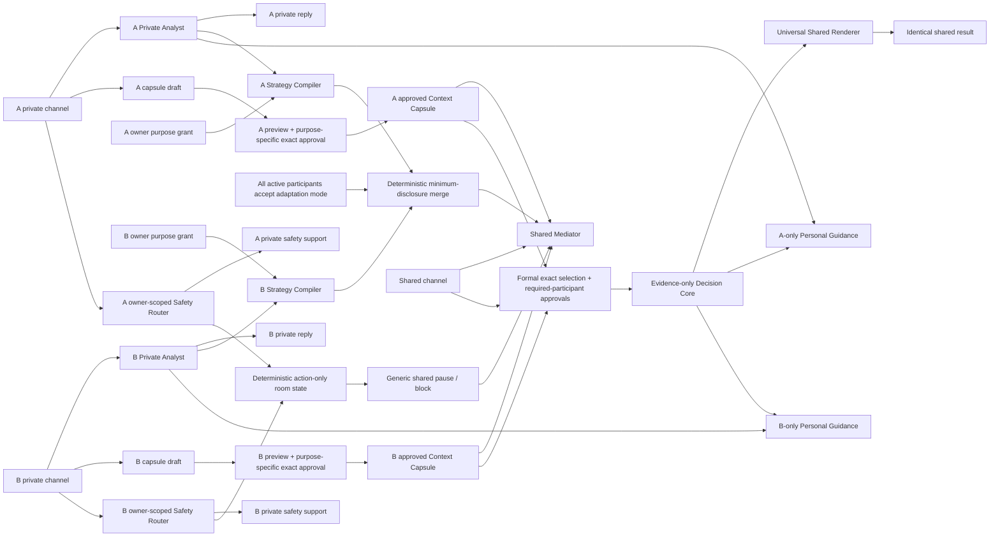

# Chat 私密上下文與共同調解隔離重構待辦

<!-- CORE_DOC_AUDIT_METADATA:START -->
**文檔類型**：問題治理
**覆蓋範圍**：Chat 私人空間、共同調解、Chat-to-Judgment、Repair、心理背景、ProfileSnapshot 與跨案件記憶的讀取、用途、披露、同意及跨端契約
**取證代碼入口**：`backend/prisma/schema.prisma`、`backend/src/app.ts`、`backend/src/routes/chat.routes.ts`、`backend/src/routes/ai-stream.routes.ts`、`backend/src/services/chat.service.ts`、`backend/src/services/judgment.service.ts`、`backend/src/services/reconciliation.service.ts`、`backend/src/services/profile-snapshot.service.ts`、`backend/src/services/ai-request-ledger.service.ts`、`backend/src/services/cost-monitoring.service.ts`、`backend/scripts/verify-ai-request-ledger-runtime.ts`、`frontend/src/pages/Chat/Room`、`mobile/app/(app)/chat/room.tsx`、`packages/contracts/src/chat.ts`、`packages/api-client/src/m3.ts`、`.github/workflows/production-deploy-and-verify.yml`、`scripts/ops-release-smoke.sh`、`scripts/smoke-production-like.sh`、`scripts/rollback-production-release.mjs`、`scripts/lib/production-release-state.mjs`
**最後核驗 Commit**：`a685db3`
**最後核驗日期**：`2026-07-13`
<!-- CORE_DOC_AUDIT_METADATA:END -->

**狀態**：仍在待處理；`v1.5.0` containment baseline 已由 exact `main@a685db36` 部署至 Production。CI run `29246076104` 與 Production run `29246324704` 均成功，三端 version、migration/backfill、release gate、exact AI ledger/cost breakdown 與 product-state audit 已取證。這只關閉 source、DB 與部署 blocker；per-owner strategy isolation、purpose/versioned authorization、adaptation-mode consent、durable Safety Router、AI stream active-event boundary、cross-case memory、legacy data lifecycle、live two-party 與 App native evidence仍未閉環，故不得把本次 containment release 寫成整體私人上下文治理閉環
**Owner**：Product / Backend / Web / App / Privacy & Safety governance
**優先級**：P0 confidentiality；P0 secret-evidence boundary；P1 cross-case memory

## 1. 正式產品決策

Emorapy 採用 `Read / Use / Disclose` 分離，不採用「AI 完全不能讀私密內容」，也不採用「只要不顯示原文便可自由影響共同輸出」。正式不變式如下：

> 私密內容可以在隔離層被 AI 讀取；只有資料 owner 批准 `shared_mediation_adaptation`，且所有 active participants 接受不可歸因的動態調整模式後，才可轉成不可反推出秘密的程序控制，改善共同調解的節奏與方式。任一條件缺失時只使用 universal trauma-informed baseline；私密內容不得成為共同空間中的事實、診斷、可信度、責任比例、正式梳理結論或實質建議的依據。

具體邊界：

1. **Read**：Private Analyst 可讀本人 private channel、本人已授權的 personal memory 及共同內容。
2. **Use**：Private Analyst 可私下協助本人；Mediation Strategy Layer 只可輸出受控、不可歸因、不可帶原因的程序控制，例如降低節奏、先詢問再深入、提供暫停、一次只問一題。
3. **Disclose**：Shared Mediator 不讀私人原文，也不讀創傷原因、私密主題或來源身份；只有本人預覽、編輯並批准的 Context Capsule 才可進入共同內容。
4. **Formal Analysis**：共同事實、可信度、互動責任、調整比例及正式結論，只可使用雙方可見材料，或明確批准用於本次正式梳理的 capsule。
5. **Counterfactual invariant**：在固定同一組 shared evidence 與 approved formal capsules 下，移除所有 private-only context 後，Decision Core input、共同事實、責任欄位與 Universal Shared Renderer 的正式共同結果必須 byte-for-byte 不變；shared mediation 的節奏／提問數量只可受已授權的 bounded、不可歸因、無原因 controls 影響，私人背景亦只可在本人可見的 Personal Guidance 中調整提醒方式，不得進 shared renderer。
6. **Safety exception**：自傷、暴力、脅迫控制等私密訊號可觸發獨立 safety workflow、私下支持或暫停共同流程；共同空間只顯示不揭密的安全提示，不把秘密變成對另一方的指控或責任證據。

這項決策由 `EMO-ADR-010` 承接。`a685db36` 已通過 exact main SHA 的 `Production Deploy and Verify`、runtime DB artifact、release gate 及線上 canary，可宣稱該 containment baseline 已發布；cross-case memory、legacy data lifecycle、side-channel controls、Safety Router 與 live two-party / App evidence完成前，仍不得宣稱整個私人上下文治理已閉環。

## 2. `origin/main` 歷史缺口基線

以下是核對歷史 `origin/main@95fa8a9` 得出的缺口，用來說明 v1.5.0修正來源；它不是目前 `main` 或 Production的實作狀態：

1. `ChatService.listMessages()` 以 `roleA` 是否房主決定是否跳過 visibility filter。兩邊都能發 `owner_only`，因此 B 方的「僅本人可見」可能被 A 看見，B 反而在 reload 後看不到。
2. Chat AI 只阻止 private message 當下觸發 AI，但後續 public message 會把房內最近 30 則訊息全部放進 prompt；AI 回覆與 AI stream 固定為 room-wide / `all`，形成 indirect disclosure。
3. `summary_only` 只是原始訊息的 visibility label；後端沒有先生成摘要，也沒有讓擁有人預覽批准。原文與「可共享摘要」不是不同資料物件。
4. room-wide AI stream access 只驗證有 room access，沒有 participant/channel audience；private AI reply 若直接沿用現有 scope 會被另一方 replay 或訂閱。
5. Chat-to-Judgment 已只納入 `user_text + visibility_scope=all`，但 B 方同意只是由 caller 傳入 boolean，沒有 B 本人、精確訊息集合、內容版本與用途綁定的 consent record。
6. Judgment 在全域 psych consent 與 feature flag 下可把 `ProfileNarrative`、`ProfileInsight`、個人/關係 profile 與 case context 注入 emotional analysis、responsibility ratio 及 summary。現有 prompt 聲明「僅作參考」不是可驗證的 secret-evidence 隔離。
7. 現行同意文案寫「只有你能查看」，同時又稱後續分析會更個人化，沒有說明私人資料會否影響共同梳理、責任或另一方看到的輸出，與實際用途邊界不清。
8. Repair plan generation 會把 `caseContext` 與 Judgment `emotional_analysis` 格式化為 personalization / diagnostic context 後直接交給方案生成，沒有 purpose-specific consent，也沒有先區分 solo-private plan 與雙方可見 plan。
9. Judgment 生成會為參與者建立 `ProfileSnapshot`；若 narrative 沒有 `ai_summary`，snapshot 會保存 `raw_narrative.slice(0, 500)`。刪除心理資料時 snapshot 被明確保留，與用戶可見「只保留簡化摘要、不含原始敘述」文案存在直接衝突。
10. room event 以 `roomId` 廣播 message metadata，AI stream 亦只做 room access；即使 message list 修正，private message ID、sender 或 replay 仍可能側漏。reply target 目前只驗證同房，沒有驗證 actor 對 target 的 audience access。
11. `RelationshipProfile` 是同 pairing 的單一 record，任一 member 可直接覆寫，沒有 proposal、雙方 exact version approval 或撤回；因此不能把它直接當成 jointly approved relationship memory。

### 2.1 v1.5.0 已合併實作基線

`main@a685db36` 已包含並部署以下 containment 能力；後續 governance work 不得放寬下列產品／隱私契約：

1. sender-private / shared message projection、channel-scoped reply/event/SSE、`chat_channel` AI stream access，以及 legacy `summary_only` write fail-closed。
2. `ChatChannel`、`ContextCapsule`、`ContextAuthorization`、`ChatAnalysisRequest`、participant approval、`ContextUseAudit` 的 additive schema，以及 active exact authorization 的跨 process unique hardening；migration 本身不做資料 backfill。
3. owner-scoped Private Analyst、strict JSON mediation controls、shared-only context resolver、exact-purpose capsule authorization 與低敏 audit。
4. Web 與 App 的 `共同對話` / `我與 AI` lane、private-context preference、capsule draft/grant、analysis request/decision/submit，以及 exact source preview；兩端均已提供 purpose-scoped authorization 與未開始 processing 前本人 exact approval 的撤回入口，並只向 roleA 提供證據選擇及建立 request 控制。App 證據選擇預設為零，需逐則選擇共同訊息或已批准摘要，並將同一 request 的 decision / revoke / submit / judgment handoff 串行化。App user/private query 額外綁定 identity epoch；credential clear 或 A→B login 前會先 cancel/remove 舊 scope，late A response 不得寫回或顯示在 B 身份。
5. `request-judgment` 已接受 `analysis_request_id`；任何 B material 都要經 submitted request 的雙方 exact approval，caller boolean 已從 request contract 移除。
6. Judgment Decision Core 不讀 private profile / case context；目前 Delivery Renderer 只可套用受控程序提示，但這仍不是目標終態。P0 需把雙方可見輸出收斂為不接收 hidden controls 的 Universal Shared Renderer，另把本人個人化提醒放入 owner-only Personal Guidance。shared Repair 不再讀 purpose-unknown diagnostic/personalization context；新 ProfileSnapshot 不再從 `raw_narrative` fallback。
7. channel backfill、legacy privacy / ProfileSnapshot read-only audit 與完整 unit/contract/client gates 已有可執行入口；fresh PostgreSQL / Redis 的 migration、backfill dry-run / apply、row/orphan/quarantine 檢查、idempotency、legacy privacy audit 及 exact Docker image runtime 已在本地通過。原本把私人資料描述成會自動個人化正式梳理的 consent/profile 文案已改為 private-first、另行預覽批准的用途邊界。
8. `ChatMessage.ai_context_eligible` 作為持久、deny-by-default 的 context gate；新 channelized writes 明確標記，legacy private / summary / AI / system 及未分類 row 均不得進入 AI context。
9. 私人原文交給 external AI 前必須先持久化 `requested` low-sensitivity audit；audit 失敗時 provider call 為零，provider 後只記錄 `emitted / schema_rejected / provider_failed` outcome，audit 不包含原文。
10. message send 與 private-context preference update 均在 Serializable transaction 內重驗及鎖定 actor entitlement；shared send 另鎖定 active roleB，kick / leave 先完成時必須 zero write。legacy room shared endpoint 亦使用同一 shared-ready resolver，solo / invite-pending fail closed。
11. room / channel SSE 握手使用 watch 後立即重驗、buffer、headers 前二次確認與 atomic ready/flush；連線建立後每個 payload event 仍以 serial queue 做 durable entitlement revalidation，false 或 DB error 立即 close/drop，heartbeat 不承載敏感 payload。

### 2.2 已取得的 Release evidence 與仍在治理的 blockers

下列 release evidence 已取得，但後四項仍使本待辦不得移出「待處理」：

1. exact-main CI run `29246076104` 對 `a685db36` 7/7 成功；Production run `29246324704` 以同一 SHA 完成 Railway、Vercel Main/Admin 與 final release gate，rollback job skipped。
2. 兩個 Chat context migrations、27 項 migration state、16/16 release-blocking parity、bounded backfill dry-run/apply、idempotency、legacy privacy audit、remaining/quarantine/orphan 均已在 Production artifact 重驗通過。
3. release smoke 已證明 exact synthetic `judgment_draft` ledger 為 `succeeded/completed`、有 token/cost，Admin costs 可讀 `quick_single` breakdown；新 Railway deployment 的 ledger/DB pool 指定 warning count均為 0，四類 product-state finding亦全為 0。
4. Main/Admin 公開頁、Backend version/live/ready/health 與 public browser canary 已通過；這證明部署可用，不替代雙身份 private/shared 真服務 E2E 或 App native lifecycle evidence。
5. ProfileSnapshot / legacy mixed-context data 仍只有 read-only inventory；清理、保留、重建、retention/export/delete 與用戶權利裁決必須另行審批，發布 workflow 不得默認刪改 legacy records。
6. cross-case PersonalMemory / JointMemory、共同記憶雙方 exact-version approval、per-owner retrieval 與完整資料管理仍未實作；raw transcript 不得自動跨案件重用。
7. per-owner Strategy Compiler、`shared_mediation_adaptation` 與 formal purpose split、共同房間 adaptation-mode consent、durable Safety Router，以及 `chat_room / chat_channel` AI stream active-event逐 payload durable revalidation仍是 P0。
8. credential-backed live two-party、Redis/archive/redaction、App native background/reconnect/Push landing 與 side-channel/counterfactual tests仍須獨立取證；不能由本次 Web/Backend Production release 外推。

### 2.3 首次 Production 發布事故與修正邊界（2026-07-13）

1. `Production Deploy and Verify` run `29235214095` 在正式部署前的 rollback baseline capture 安全停止；當時 Railway `latestDeployment` 是仍在 `BUILDING` 的 GitHub Autodeploy，而真正承接流量的是唯一 `activeDeployments[0]=SUCCESS` 的 `v1.4.0` deployment。
2. 之後該 GitHub Autodeploy build 成功、兩個 additive migrations 成功，channel provisioning 亦已提交，但 message assignment transaction timeout，deployment 最終 `FAILED`；Railway 沒有把流量切到失敗 image，Web、Admin、Backend 仍維持 `v1.4.0@95fa8a9`。
3. 修正採 roll-forward：不得刪除已建立 channel、不得 down-migrate；backfill 需從「channel 已存在、message 尚未 assignment」的 partial state安全重入。
4. rollback baseline selector 必須以唯一 active `SUCCESS` deployment 為 live source，並與 backend `/version.deploymentId` 交叉核對；若另有 `BUILDING / DEPLOYING / QUEUED / INITIALIZING / PENDING` deployment，必須 fail closed，不能在平台切流競態期間捕捉 baseline。
5. Railway Production service 保留 GitHub repo source，但 GitHub Autodeploy 必須停用；正式 Production mutation 只由 `Production Deploy and Verify` 的 exact-SHA `railway up` 執行。workflow 必須 read-only 驗證 `autoDeploy.enabled=false`，設定漂移時在任何新部署前停止。
6. run `29238278283` 已由 exact `main@c031057` 完成 Railway deployment `a0f5083a-417c-4328-96a2-5e65dd7df9e1`；backend `/version`、`/health/live`、`/health/ready` 均對齊且 ready。主站 staged deployment 雖已 Ready 並回報 `c031057`，但 CLI 55 把 argv `--token` 誤交原生 curl，故未 promote；主站與 Admin production domain 均維持舊版。
7. 同一 run 的 rollback 在 mutation validation 階段失敗：live Railway schema 為 `deploymentRollback(id): Boolean!`，舊 helper 卻要求 `{ id status }`，HTTP 400 前沒有執行 rollback。release recovery 必須以 target `canRollback` 與 project/environment/service scope 作 preflight，scalar mutation 只表示接受，再輪詢實際 active `SUCCESS` deployment 與 backend version；不得猜測新 deployment id 或自動 fallback redeploy。
8. Railway rollback 本身原子恢復 image 與 custom variables；只有 backend 從未切換、但 deploy job 已預先 stamp commit marker 時，才可用 `--skip-deploys` 恢復 `EMORAPY_COMMIT_SHA`。HTTP 非 2xx 必須把已 sanitize 的 GraphQL error 寫入 artifact，不能只留 generic 400。
9. run `29240717786` 已證明 Vercel verifier 與 live scalar Railway rollback 修正有效：Main/Admin/Backend 曾同時對齊 `8bb9f04`，version、static env、health、DB parity、AI pricing、smoke hygiene、quick/claim-session smoke 均通過；final product-state audit 在 `chatToCaseLink.findMany()` 收到 `EMAXCONNSESSION`，原因是 8 個頂層 Prisma query 以 `Promise.all` 與 live backend 競逐 session-mode pool，不代表該 query 或資料 finding 失敗。
10. 同一 run 的自動 rollback 成功，artifact 記錄 `status=restored`、`failedSurfaces=[]`、database action `none`；Backend 由新 Railway rollback deployment 恢復 `c031057`，Main/Admin 恢復 `95fa8a9`。這證明失敗時可安全回 baseline，但不能把成功 rollback 寫成成功 release。
11. `dea5520` 把 product-state audit 的 8 個頂層查詢改為 sequential reads，regression test 要求最大 active query concurrency 為 1；同一 Production environment read-only 實測四類 finding 均為 0。不得以 workflow URL 拼接 `connection_limit` 或 blanket retry 擴大 hotfix；若 sequential audit仍再次飽和，先以 Supabase metrics 與 Railway replica/runtime pool 實證 capacity budget，再作獨立治理決策。
12. 同一 run logs 顯示 `AI request ledger start/finish failed`，根因不是資料表或 migration，而是 Prisma model `AIRequestLedger` 的 generated delegate 為 `aIRequestLedger`；舊 service 自造 `aiRequestLedger` interface 後 cast，令 runtime `upsert/update/findMany` 讀取 `undefined`，AI 主流程雖可回應但 request ledger 與 Admin breakdown 靜默失效。
13. `24c0eb7` 已以 `Pick<PrismaClient, 'aIRequestLedger'>`、typed database module 與 runtime-shaped mocks 修復；`b3f3716` 令 release smoke 只以本次 synthetic case 的 exact `case_judgment / quick_single / judgment_draft` scope驗 `succeeded/completed/tokens/cost`，再查 Admin costs ledger。Production run `29246324704` 已證明 exact row與 Admin breakdown，且新 deployment指定 ledger warning count為 0；verifier只輸出低敏狀態與布林值。

### 2.4 第二輪私密上下文審核後的方案修正

「AI 看得到、對方看不到原文」只解決直接披露，未解決 shared output 的可觀察 side channel 或秘密證據。後續方案因此更新為：

1. Private Analyst 可充分使用本人 private history，但預設只影響本人私下回覆、協助本人整理 capsule 及辨識安全需要；不得以推斷的人格、創傷或弱點秘密改寫共同事實、責任、建議或 joint Repair。
2. Shared Mediator 採 universal trauma-informed baseline，所有房間都具分段、先詢問及暫停選項。動態調整必須同時滿足：資料 owner 以獨立、purpose-scoped、versioned authorization 批准其 private-derived controls；所有 active participants 接受「不可歸因的動態流程調整模式」。任一方不接受時，hidden controls 全部關閉，只保留 universal baseline；shared mediation 與 formal delivery 不得共用一個 participant enum。
3. Private safety signal 需進入獨立 Safety Router，只可輸出 `continue / private_checkin / pause_shared / block_joint_repair / crisis_support` 等 action；共同空間只收到 generic pause，不收到事件、來源、診斷或責任暗示。現有 private reply 尚未建立 durable pause state，仍屬未完成。
4. AI stream 的 `chat_room / chat_channel` active event 必須與 room/channel SSE 一樣逐 payload durable revalidation；只靠 process-local revoke加週期 polling仍有 cross-instance窗口。
5. A、B 的 private histories 不得同時進入同一 model request。每位 owner 由獨立 Strategy Compiler 產生短期 bounded action vector，再由 backend deterministic、minimum-disclosure merge；merge 不得接收或輸出 topic、reason、diagnosis、source identity 或 free text。
6. Capsule saved draft/revision/discard/re-authorize、owner-facing usage receipt、structured audit refs、retention/export/delete、per-owner retrieval、solo/joint Repair resolver，以及 PersonalMemory / 雙方 exact-approved JointMemory 均保持後續 scope。raw transcript、責任比例、單方指控、safety label及人格／創傷診斷不得自動跨案件記憶。

### 2.5 成功 Production release evidence（2026-07-13）

1. exact-main CI：run `29246076104`，SHA `a685db36d933945b9d30fe5447122cb98cff02e8`，7/7 jobs success。
2. Production workflow：run `29246324704`，同一 SHA，五個核心 jobs success；rollback skipped。
3. Railway：deployment `7b55b8ec-af7a-4dbb-bd61-a95715c422fb`，唯一 active `SUCCESS`；Backend `/version`、`/health/live`、`/health/ready`、`/health` 均對齊且 healthy/ready。
4. Vercel：Main deployment `dpl_FRjxZK96HPMk8iGLHUCXch7jce6t`、Admin deployment `dpl_CrEQAvziWoYLJn77sSdwHzbdjZBu`；正式 aliases 與公開 `/version.json` 均對齊 exact SHA。
5. Release artifacts：27 migrations無 pending；required parity 16/16；backfill dry-run/apply、remaining/quarantine/orphan/failure/unknown 均為 0；legacy audit 無 blocking finding。
6. Runtime：exact ledger row `succeeded/completed` 且有 token/cost；Admin costs 可讀 `quick_single` breakdown；四類 product-state finding及指定 ledger/DB pool warnings均為 0。
7. Public canary：Main 與 Admin 登入頁無 console error；Quick Create 可正常使用。fresh session 的 `GET /cases/by-session` expected-empty 404 只形成 P2 DevTools/monitoring noise，不是 release blocker。

## 3. 目標架構

### 3.1 Channel，而不是 visibility dropdown

新增 `ChatChannel` 作 audience 邊界：

- `shared`：雙方與 Shared Mediator 可讀。
- `private`：只有 owner participant 與 Private Analyst 可讀；每位參與者各自獨立。

新訊息寫入 channel，不再靠同一 transcript 內的 `visibility_scope` 猜 audience。`visibility_scope` 只作相容欄位，完成遷移後 deprecated。

### 3.2 Context Capsule，而不是 `summary_only`

`ContextCapsule` 是由私人材料衍生、但與原文分離的版本化資料物件：

- owner 可預覽、編輯或放棄；AI 草稿不會自行分享。
- 每次批准綁定 exact content hash、purpose、audience、target room/case/pairing、有效期與 policy version。
- 修改後形成新版本，舊批准自動失效。
- 分享後不能承諾收回對方已看見的內容，但可停止後續 AI 再使用及跨案件重用。
- 指控、診斷或未證實事件進入 capsule 時必須保留「誰的陳述」與 uncertainty，不升格為共同事實。

### 3.3 Central Context Policy

新增集中式 `ContextPolicyService` / repository boundary。任何 AI caller 不得自行查最近 N 則訊息或 profile table 後拼 prompt；必須請求一個 typed context bundle：

- `private_support`
- `shared_mediation_adaptation`
- `formal_shared_evidence`
- `formal_shared_delivery`
- `formal_owner_guidance`
- `future_private_support`
- `future_joint_support`

bundle 必須帶 `audience`、`purpose`、`source refs`、`authorization refs`、`policy version` 與低敏 audit result。Ledger、log 與普通 Admin report 不得保存原文。

### 3.4 Strict Mediation Controls

每位 participant 使用獨立 Strategy Compiler；任何單次 model request 只可包含該 owner 的 private bundle與共同可見 process state，不得同時載入 A、B private histories。Compiler 只能輸出短期 schema allowlist，不接受自由文字，例如：

- `pace: normal | slower`
- `ask_permission_before_depth: boolean`
- `offer_pause: boolean`
- `question_style: open | concrete | gentle`
- `max_questions: 1 | 2`

不得輸出 topic、原因、診斷、事件、引用、角色弱點或能讓另一方反推秘密的 free text。Backend 只以 deterministic merge 合併已授權 vectors：`pace` 取較保守值、permission/pause 取 OR、`max_questions` 取最小值，其他欄位按固定 priority table；不得再調用一個同時看兩方 private output 的 merge model。解析失敗、越界值、缺 owner authorization、任一 participant 未接受 adaptation mode，或模型夾帶文字時 fail closed：丟棄 dynamic controls，只用 universal baseline，不降級為直接把 private text 給 Shared Mediator。

### 3.5 Evidence-only Judgment

正式梳理拆成三個不可混用的 surface：

1. `Decision Core` 只接收 shared messages、雙方批准的 analysis capsule、正式 evidence 與明示為 current-case statement 的材料，輸出 immutable structured findings / uncertainty / ratio fields。
2. `Universal Shared Renderer` 只接收 Decision Core與 universal trauma-informed baseline；private context on/off 下，雙方可見內容必須 byte-for-byte 相同，不得接收 hidden controls。
3. `Owner-only Personal Guidance` 可在本人授權後使用本人的 private support context，生成只給本人的「給我的提醒」；它不得改 structured fields、共同建議或 joint Repair，也不得被另一方或 shared archive 讀取。

全域 psych consent 不再等同「可把私人 profile 用於共同責任判斷」。PersonalMemory 只可支援本人私下內容或 owner-only Personal Guidance；JointMemory 必須雙方批准 exact version 才可作共同上下文。

Repair 亦必須沿用同一 resolver：solo-private plan 可以在該用戶授權後使用其 personal context，輸出只給本人；雙方可見的 joint plan 只可使用 shared evidence、雙方批准的 joint memory 及當前 plan preferences，不得讀另一方 private profile 或 hidden diagnostic context。

## 4. 使用者流程與內容設計

1. Chat room 不再顯示三項技術 visibility dropdown，改為兩個清楚空間：`共同對話`、`我與 AI`。
2. `共同對話` composer 固定顯示「你、對方與 AI 都能看到」。`我與 AI` 固定顯示「只你與 AI 能看到」。兩邊保存不同 draft，切換時不搬運文字。
3. 新建 room 預設進入 `我與 AI`；接受邀請前設 trust checkpoint，清楚列出會看到、不會看到、AI 如何使用私人內容及正式梳理會採用甚麼。對方首次加入或用戶重新進入 group room 時，先顯示一次短說明並取得 adaptation-mode choice，再開 shared composer：
   - AI 可在本人同意後用私人背景調整節奏與方式；
   - 不會引用、暗示或把它拿來判斷誰對誰錯；
   - 每位 owner 可選 `允許我的私密內容只產生不可歸因的流程調整` 或 `只限私下協助`；所有 active participants 都接受動態調整模式時才啟用，否則共同空間只用 universal baseline。
4. 私聊後由 AI 提供次要 CTA `整理成可分享內容`；用戶預覽/修改後才建立 capsule。主 CTA 不預先勾選「納入正式梳理」。
5. 發起正式梳理時，顯示 exact selected shared messages / capsules、排除原因與結果 audience。若包含 B 的內容，B 必須在自己的 session 批准同一 selection hash；A 不能替 B 勾選 consent。
6. 個人資料管理新增：`私人記憶`、`共同記憶`、來源、使用目的、最近使用、修正、停用與刪除。未經 durable opt-in，不跨案件重用 raw transcript。
7. 共同記憶只保存雙方批准的 relationship practice / agreement，不自動保存責任比例、單方指控、危機標籤或人格診斷。
8. 梳理結果分為雙方相同的 `共同梳理` 與每人各自可見的 `給我的提醒`；後者可用本人 private memory，但必須明示不屬共同結論，也不能改 shared structured result。
9. 結果提供 `這次使用了甚麼` receipt，只顯示低敏數量、source type、purpose、policy version 與 approval refs，例如共同訊息/批准 capsule 數量及「私人筆記只用於調整節奏」；不顯示 private content 或另一方的 private lineage。

建議核心文案：

> 私下內容可以幫助 AI 更溫和地安排共同對話，但不會向對方透露原因，也不會拿來判斷誰對誰錯。若有內容值得共同討論，你會先看到並批准可分享版本。

## 5. 資料與 API 契約

`v1.5.0` baseline 已新增的最小 domain model：

1. `ChatChannel`：`room_id / kind / owner_participant_id`，以 DB unique constraint 保證每房 shared channel 及每 participant private channel 唯一。
2. `ChatMessage.channel_id / ai_context_eligible`：expand migration 的 channel 先 nullable，eligibility 必填且預設 false；新 channelized writes 明確設定 true，legacy `visibility_scope` 只保留一個顯示相容窗口，不能代替 AI context 授權。
3. `ContextCapsule`：immutable version、owner、source refs、summary、status、content hash、sensitivity class。
4. `ContextAuthorization`：subject、purpose、audience、target、capsule version/hash、granted/revoked/expired timestamps。
5. `ChatAnalysisRequest` + participant approvals：綁定 exact selected message/capsule snapshot；submit 前 backend 重驗 active participant、hash 與 authorization。
6. `ContextUseAudit`：只保存 source IDs、purpose、audience、policy/prompt version、allow/deny reason code，不保存 private content。

`ProfileSnapshot` 不得繼續作為未經 purpose approval 的私人原文保留通道。新模型若需要保存已用於正式梳理的不可變輸入，只保存 exact approved capsule/evidence refs、hash 與 policy version；不可把 raw narrative fallback 複製入 case-bound snapshot。

`a685db36` 已 additive 新增並部署 channel、capsule、authorization、analysis request/approval endpoints，並擴充 shared contracts、`@emorapy/api-client`、Web 與 App 消費面；legacy room message / `included_message_ids` 路徑仍保留相容窗口。本地與 Production DB backfill、完整三端 release artifact均已通過；舊 client 相容觀察、deprecation、App native release及本節新增的 per-owner compiler / purpose split仍由本文件追蹤。

為避免現有大檔繼續膨脹，建議 service boundary 固定為：

- `chat.service.ts`：room / invite / participant / legacy compatibility 與薄 handoff facade。
- `chat-channel.service.ts`：channel provisioning / access / history projection。
- `chat-message.service.ts`：message list / send / reply、Serializable entitlement lock 與 private/shared AI lane dispatch。
- `chat-judgment-orchestrator.service.ts`：Chat-to-Analysis exact evidence claim、retry、Case/Link、external AI 與共用 finalize/fail lifecycle。
- `chat-context-policy.service.ts`：Read / Use / Disclose resolver。
- `private-analyst-orchestrator.service.ts`、per-owner `mediation-strategy.service.ts`、deterministic `mediation-control-merge.service.ts`、`chat-ai-orchestrator.service.ts`：private、strategy、merge、shared 四個隔離 lane。
- `safety-router.service.ts`：把 private signal 轉為 durable action-only state；shared surface 只接收 generic pause/block。
- `context-capsule.service.ts`：draft / version / approve / revoke / hash。
- `chat-analysis-request.service.ts`、`chat-analysis-evidence.service.ts`、`chat-context-read.service.ts`：server-owned selection、participant approval、preview 與 typed evidence bundle。
- `ai-stream-scope-access.ts`：scope audience authorization。

`chat.service.ts` 只作相容 facade；Judgment / Repair 改接 typed bundle，不再各自查 profile / message table 後拼 prompt。

## 6. Legacy migration 與相容性

1. `all` 且在 B 加入後的 message 回填到 shared channel；B 加入前只有 `share_full_history` 可回填 shared，`share_summary_only / share_from_join_time` 或從未有 B 的 pre-join material 回填 roleA private，避免 backfill 擴大舊 audience。
2. `owner_only` 回填到該 message sender 的 private channel；不可依 room owner 推斷 owner。
3. `summary_only` 一律視為 `legacy_review_required` private material，不自動把原文放進 shared channel；用戶日後可重新產生並批准 capsule。
4. pre-join `safety_notice` 回填 private；不得因 room history mode 重新公開安全原因。
5. 舊 public AI messages 可能曾讀取 mixed-visibility context。保留歷史顯示，但必須持久化 `ai_context_eligible=false`，不得自動進入 future memory、capsule source、formal analysis 或 shared Repair。legacy private / summary / system 同樣為 false；只有分類為 shared 的 human `user_text` 可在 backfill 明確設為 true。
6. 新 room 預設只分享 partner join 之後的 shared channel；`share_full_history / share_summary_only` 進入 deprecation，不再用一個 room setting 自動披露 pre-join raw history。
7. 舊 client 在相容窗口提交 `summary_only` 時，backend fail safe 地保存為 private + `legacy_summary_requested`，不得假裝已分享；response 需回傳 controlled warning code，強制端側升級。

## 7. 分波實作方案

### Wave 0 — P0 containment（Production deployed @ `a685db36`）

- 修正 `owner_only` sender projection，雙方只見自己的 private message。
- shared AI prompt 立即只讀 shared/join-time eligible context；private、`summary_only`、inactive participant material 一律排除。
- private message event 不再 room-wide broadcast；reply target 必須通過同一 audience policy，另一方不能用洩露/猜測的 ID 引用 hidden message。
- 禁止新 `summary_only` 寫入；在 capsule 上線前不再提供「假摘要共享」。
- formal Judgment 停止把 private profile/case context注入 responsibility/fact/summary core；未完成 two-pass 前寧可只用 current shared evidence。
- 停止 formal Judgment 建立可能含 `raw_narrative` fallback 的 ProfileSnapshot；先以 read-only audit 統計既有 snapshot 數量、raw-like content 形態與受影響用戶，再建立清理/重建方案，不得直接把舊 snapshot 宣稱為 approved capsule。
- shared Repair plan 停止讀 purpose-unknown personalization / diagnostic context；solo plan 與 joint plan 在 resolver 層分開。
- 加 malicious echo model、兩角色 projection、shared prompt canary、room-wide stream negative tests。
- 以上 confidentiality 修正不可放在可被關閉的 feature flag 後。
- `JUDGMENT_ENABLE_PROFILE_CONTEXT / JUDGMENT_ENABLE_CASE_CONTEXT` 在 unsafe formal path 應 fail closed；新能力故障只能降級 shared-only，不得回滾成偷偷使用 private context。

### Wave 1 — Domain foundation（Production migration evidence passed）

- expand migration：channel、capsule、authorization、analysis request/audit。
- 建立 `ContextPolicyService`、audience-aware repository 與 participant-scoped `chat_channel` AI stream scope。
- shared contract / api-client / Web / App 先支援新 response，再切換 writes。

### Wave 2 — Private Analyst 與 mediation controls（baseline deployed；governance P0 partial）

- Private Analyst / private reply 使用 owner-scoped stream。
- 每位 owner 使用隔離 Strategy Compiler；deterministic merge、purpose split 與 adaptation-mode雙層 consent尚待實作。
- 安全訊號需落到 durable Safety Router；共享提示不得包含秘密原因。現有 baseline尚未完成 durable pause/block state。

### Wave 3 — Capsule 與雙方批准（Production baseline deployed；lifecycle partial）

- 已完成 baseline preview/create/approve/revoke；saved revision/discard/re-authorize、usage receipt、retention/export/delete仍待完成。
- 以 versioned `ChatAnalysisRequest` 取代 caller boolean consent。
- 補 exact selection、stale approval、撤回、離房、重入、併發批准與 idempotency。

### Wave 4 — Evidence-only Judgment 與 cross-case memory（partially implemented）

- 保留已隔離的 Decision Core，將現有 Delivery Renderer 收斂為不接收 hidden controls 的 Universal Shared Renderer，並另建 owner-only Personal Guidance；三者以 typed immutable boundary 分隔。
- personal memory 只在 durable opt-in 下供 private support；joint memory 需雙方批准；raw old transcripts 預設關閉。
- 將現有 ProfileNarrative / ProfileInsight / case context / ProfileSnapshot / Repair consumer 逐一遷移到 purpose-scoped resolver。

### Wave 5 — Release migration（Production release passed；治理完成證據仍待補）

- backfill + consistency audit；本地 fresh DB 的 dry-run / apply / idempotency 已通過，Production data assignment 亦已在 run `29238278283` 完成；legacy decision path 只有在完整 compatibility window 與資料生命週期裁決後才可移除。
- Production workflow 順序固定為 expand migration → Railway backend → chat-context dry-run/apply/audit → staged Web/Admin → exact-SHA verify → promote → release gate；run `29246324704` 已以 `a685db36` 完成同一 exact-main SHA 閉環。
- migration deploy log、dry-run/apply row counts／orphans／idempotency 與 read-only legacy privacy audit artifact 是 release-blocking evidence；缺任何一項都不得部署 Web 或宣稱完成。
- DB migration status與 release gate已通過；Web/App parity、真服務雙角色 E2E、Redis replay、archive/redaction與 App native evidence改作整體治理完成條件，不再誤寫為 containment deploy 尚未發生。
- Production 發布後持續以 synthetic canary 監測 private-to-shared leak；CI green不能單獨替代 Production evidence。

## 8. Release-blocking invariants

1. A 無法 list/reply/link/replay B private message；B 對 A 同理。
2. shared prompt、stream、persisted message、archive、log、ledger 與 Admin low-sensitivity report 均不含 private canary。
3. malicious echo model 即使逐字回傳 prompt，也無法得到 private text；strategy extractor 越界時只會 fail closed。
4. Decision Core input與 Universal Shared Renderer output在 private memory on/off 下 byte-for-byte相同；responsibility/finding fields不可由 owner-only Personal Guidance修改。
5. capsule approval 綁 exact hash；編輯、撤回、過期、離房或 target 改變後舊 approval 不能重用。
6. 任何 B material 進入 formal analysis，必須有 B 本人對 exact snapshot 的 server-verifiable approval；caller boolean 不成立。
7. private safety signal 可暫停 shared flow，但 shared output 不洩露事件、診斷、來源或責任暗示。
8. raw prior transcripts、legacy mixed-context AI replies、responsibility ratio、單方 allegation 及 safety labels 不會自動跨案件載入。
9. 新 ProfileSnapshot 不含 raw narrative fallback；既有 snapshot 有 read-only inventory、清理/保留裁決、用戶權利與可重放 migration evidence。
10. joint Repair plan 不接收 private profile/diagnostic context；solo-private plan 的 context 與 output 均只屬本人。
11. Web / App 顯示相同 audience / purpose / revoke 語義；App stream replay 不得用 Web 測試代替。
12. migration row count、orphan channel、capsule authorization、legacy summary quarantine、release DB parity 與 rollback/forward-fix 均有可重放證據。
13. 任何 private raw external-AI disclosure 都有 provider 前 durable requested audit；audit 寫入失敗時 provider invocation 必須為零。
14. kick / leave 在 SSE handshake 或 active stream event 前勝出時，room/channel 都是 zero payload write；shared send 與 preference update 亦在同樣 interleaving 下 zero DB write。
15. 正式 release smoke 建立的 exact synthetic `judgment_draft` 必須在 `AIRequestLedger` 成功落庫、完成並具 token/cost；Admin costs 必須讀到未降級的 `quick_single` breakdown，且新 Railway deployment 的 ledger start/finish warning count 為 0。pricing config pass、24 小時 aggregate 或 AI HTTP response 任一項都不能單獨代替此證據。

## 9. 文件與驗證入口

實作時必須同步：

- `00-跨端產品核心/01-產品PRD總章.md`
- `02-用戶端核心流程/00-用戶端核心流程總覽.md`
- `04-共用機制/03-AI風險與安全治理基線.md`
- `04-共用機制/04-資料治理與隱私風險基線.md`
- `05-工程架構與共享層/02-架構決策與ADR治理基線.md`
- `05-工程架構與共享層/03-資料模型SchemaMigration與相容性治理基線.md`
- `06-接口描述/07-chat.md`、`06-接口描述/04-judgment.md`
- `08-測試規範與驗收/02-AI流式與Chat治理驗收基線.md`、`04-需求驗證矩陣.md`、`06-SchemaMigration與相容性驗收基線.md`
- `20-App端/`、`50-跨端Mapping與Parity/`、根層 API / Mapping / flow 主冊

最低命令由 touched-area tests 補齊後確定；至少包括 backend focused unit/integration、shared contract/api-client、Web Chat、App M3/platform、schema migration/precheck、`npm run docs:check`、`npm run docs:audit:dry-run:current` 及正式 release gate evidence。

## 10. 外部設計依據

1. [NIST AI RMF — AI Risks and Trustworthiness](https://airc.nist.gov/airmf-resources/airmf/3-sec-characteristics/)：privacy-enhanced、transparency、explainability 與可追責需按使用情境共同治理。
2. [SAMHSA Trauma-Informed Approaches](https://www.samhsa.gov/mental-health/trauma-violence/trauma-informed-approaches-programs)：安全、透明、合作、選擇與避免再度創傷支援「改善方式，不秘密裁決」的產品邊界。
3. [OWASP LLM Prompt Injection Prevention](https://cheatsheetseries.owasp.org/cheatsheets/LLM_Prompt_Injection_Prevention_Cheat_Sheet.html)：結構化隔離、least privilege 與 privileged/untrusted context 分層優於只靠 prompt 警告。
