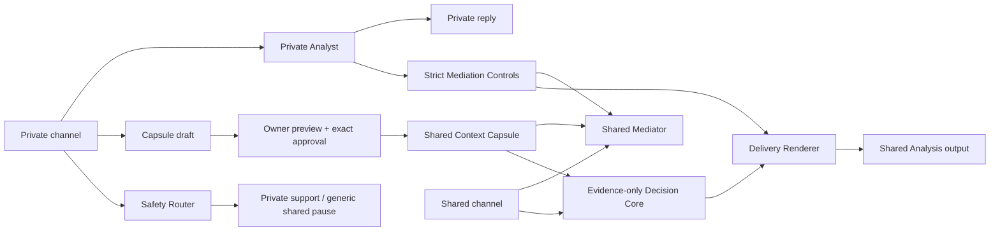

# Chat 私密上下文與共同調解隔離重構待辦

<!-- CORE_DOC_AUDIT_METADATA:START -->
**文檔類型**：問題治理
**覆蓋範圍**：Chat 私人空間、共同調解、Chat-to-Judgment、Repair、心理背景、ProfileSnapshot 與跨案件記憶的讀取、用途、披露、同意及跨端契約
**取證代碼入口**：`backend/prisma/schema.prisma`、`backend/src/app.ts`、`backend/src/routes/chat.routes.ts`、`backend/src/routes/ai-stream.routes.ts`、`backend/src/services/chat.service.ts`、`backend/src/services/judgment.service.ts`、`backend/src/services/reconciliation.service.ts`、`backend/src/services/profile-snapshot.service.ts`、`frontend/src/pages/Chat/Room`、`mobile/app/(app)/chat/room.tsx`、`packages/contracts/src/chat.ts`、`packages/api-client/src/m3.ts`
**最後核驗 Commit**：`1c1d7e1`
**最後核驗日期**：`2026-07-13`
<!-- CORE_DOC_AUDIT_METADATA:END -->

**狀態**：仍在待處理；release candidate 已於 `main@30c21bb` 合併且 exact-main CI 全綠，但首次 Production 發布安全失敗：additive migrations 與 channel provisioning 已落到 Production DB，message assignment 因 Prisma interactive transaction timeout 未完成，線上 runtime 仍是 `v1.4.0@95fa8a9`；roll-forward hotfix 已實作並通過本地、fresh PostgreSQL 與 Production schema read-only 驗證，發布完成與否只由 exact-main workflow artifact 與 live version 裁決，cross-case memory 與 legacy data lifecycle 持續保持活躍
**Owner**：Product / Backend / Web / App / Privacy & Safety governance
**優先級**：P0 confidentiality；P0 secret-evidence boundary；P1 cross-case memory

## 1. 正式產品決策

Emorapy 採用 `Read / Use / Disclose` 分離，不採用「AI 完全不能讀私密內容」，也不採用「只要不顯示原文便可自由影響共同輸出」。正式不變式如下：

> 私密內容可以在隔離層被 AI 讀取，並在本人授權後轉成不可反推出秘密的程序控制，改善共同調解的節奏與方式；未經資料擁有人批准，私密內容不得成為共同空間中的事實、診斷、可信度、責任比例、正式梳理結論或實質建議的依據。

具體邊界：

1. **Read**：Private Analyst 可讀本人 private channel、本人已授權的 personal memory 及共同內容。
2. **Use**：Private Analyst 可私下協助本人；Mediation Strategy Layer 只可輸出受控、不可歸因、不可帶原因的程序控制，例如降低節奏、先詢問再深入、提供暫停、一次只問一題。
3. **Disclose**：Shared Mediator 不讀私人原文，也不讀創傷原因、私密主題或來源身份；只有本人預覽、編輯並批准的 Context Capsule 才可進入共同內容。
4. **Formal Analysis**：共同事實、可信度、互動責任、調整比例及正式結論，只可使用雙方可見材料，或明確批准用於本次正式梳理的 capsule。
5. **Counterfactual invariant**：移除所有 private-only context 後，Decision Core 的 evidence input、事實結論與責任欄位必須不變；私人背景只可在獨立 Delivery Renderer 中調整表達方式。
6. **Safety exception**：自傷、暴力、脅迫控制等私密訊號可觸發獨立 safety workflow、私下支持或暫停共同流程；共同空間只顯示不揭密的安全提示，不把秘密變成對另一方的指控或責任證據。

這項決策由 `EMO-ADR-010` 承接。release candidate、本地全綠或 GitHub push 均不代表 `origin/main` 或 Production 已符合；只有 exact main SHA 的 `Production Deploy and Verify`、runtime DB artifact、release gate 及線上 canary 成功，才可宣稱該版本已發布。cross-case memory 與 legacy data lifecycle 完成前亦不得宣稱整個私人上下文治理已閉環。

## 2. `origin/main` 歷史缺口基線

以下是核對 `origin/main@95fa8a9` 得出的歷史缺口，用來說明 v1.5.0 修正來源；它不是目前 `main` 的實作狀態，也不代表 Production 已隨 source 改變：

1. `ChatService.listMessages()` 以 `roleA` 是否房主決定是否跳過 visibility filter。兩邊都能發 `owner_only`，因此 B 方的「僅本人可見」可能被 A 看見，B 反而在 reload 後看不到。
2. Chat AI 只阻止 private message 當下觸發 AI，但後續 public message 會把房內最近 30 則訊息全部放進 prompt；AI 回覆與 AI stream 固定為 room-wide / `all`，形成 indirect disclosure。
3. `summary_only` 只是原始訊息的 visibility label；後端沒有先生成摘要，也沒有讓擁有人預覽批准。原文與「可共享摘要」不是不同資料物件。
4. room-wide AI stream access 只驗證有 room access，沒有 participant/channel audience；private AI reply 若直接沿用現有 scope 會被另一方 replay 或訂閱。
5. Chat-to-Judgment 已只納入 `user_text + visibility_scope=all`，但 B 方同意只是由 caller 傳入 boolean，沒有 B 本人、精確訊息集合、內容版本與用途綁定的 consent record。
6. Judgment 在全域 psych consent 與 feature flag 下可把 `ProfileNarrative`、`ProfileInsight`、個人/關係 profile 與 case context 注入 emotional analysis、responsibility ratio 及 summary。現有 prompt 聲明「僅作參考」不是可驗證的 secret-evidence 隔離。
7. 現行同意文案寫「只有你能查看」，同時又稱後續分析會更個人化，沒有說明私人資料會否影響共同梳理、責任或另一方看到的輸出，與實際用途邊界不清。
8. Repair plan generation 會把 `caseContext` 與 Judgment `emotional_analysis` 格式化為 personalization / diagnostic context 後直接交給方案生成，沒有 purpose-specific consent，也沒有先區分 solo-private plan 與雙方可見 plan。
9. Judgment 生成會為參與者建立 `ProfileSnapshot`；若 narrative 沒有 `ai_summary`，snapshot 會保存 `raw_narrative.slice(0, 500)`。刪除心理資料時 snapshot 被明確保留，與用戶可見「只保留簡化摘要、不含原始敘述」文案存在直接衝突。
10. room event 以 `roomId` 廣播 message metadata，AI stream 亦只做 room access；即使 message list 修正，private message ID、sender 或 replay 仍可能側漏。reply target 目前只驗證同房，沒有驗證 actor 對 target 的 audience access。
11. `RelationshipProfile` 是同 pairing 的單一 record，任一 member 可直接覆寫，沒有 proposal、雙方 exact version approval 或撤回；因此不能把它直接當成 jointly approved relationship memory。

### 2.1 v1.5.0 已合併實作基線

`main@30c21bb` 已包含以下能力；目前 hotfix 只處理 release backfill 與 rollback baseline，Production 是否承接對應版本必須另以 exact-main workflow 與 live version 取證：

1. sender-private / shared message projection、channel-scoped reply/event/SSE、`chat_channel` AI stream access，以及 legacy `summary_only` write fail-closed。
2. `ChatChannel`、`ContextCapsule`、`ContextAuthorization`、`ChatAnalysisRequest`、participant approval、`ContextUseAudit` 的 additive schema，以及 active exact authorization 的跨 process unique hardening；migration 本身不做資料 backfill。
3. owner-scoped Private Analyst、strict JSON mediation controls、shared-only context resolver、exact-purpose capsule authorization 與低敏 audit。
4. Web 與 App 的 `共同對話` / `我與 AI` lane、private-context preference、capsule draft/grant、analysis request/decision/submit，以及 exact source preview；兩端均已提供 purpose-scoped authorization 與未開始 processing 前本人 exact approval 的撤回入口，並只向 roleA 提供證據選擇及建立 request 控制。App 證據選擇預設為零，需逐則選擇共同訊息或已批准摘要，並將同一 request 的 decision / revoke / submit / judgment handoff 串行化。App user/private query 額外綁定 identity epoch；credential clear 或 A→B login 前會先 cancel/remove 舊 scope，late A response 不得寫回或顯示在 B 身份。
5. `request-judgment` 已接受 `analysis_request_id`；任何 B material 都要經 submitted request 的雙方 exact approval，caller boolean 已從 request contract 移除。
6. Judgment Decision Core 不讀 private profile / case context，Delivery Renderer 只可套用受控程序提示；shared Repair 不再讀 purpose-unknown diagnostic/personalization context；新 ProfileSnapshot 不再從 `raw_narrative` fallback。
7. channel backfill、legacy privacy / ProfileSnapshot read-only audit 與完整 unit/contract/client gates 已有可執行入口；fresh PostgreSQL / Redis 的 migration、backfill dry-run / apply、row/orphan/quarantine 檢查、idempotency、legacy privacy audit 及 exact Docker image runtime 已在本地通過。原本把私人資料描述成會自動個人化正式梳理的 consent/profile 文案已改為 private-first、另行預覽批准的用途邊界。
8. `ChatMessage.ai_context_eligible` 作為持久、deny-by-default 的 context gate；新 channelized writes 明確標記，legacy private / summary / AI / system 及未分類 row 均不得進入 AI context。
9. 私人原文交給 external AI 前必須先持久化 `requested` low-sensitivity audit；audit 失敗時 provider call 為零，provider 後只記錄 `emitted / schema_rejected / provider_failed` outcome，audit 不包含原文。
10. message send 與 private-context preference update 均在 Serializable transaction 內重驗及鎖定 actor entitlement；shared send 另鎖定 active roleB，kick / leave 先完成時必須 zero write。legacy room shared endpoint 亦使用同一 shared-ready resolver，solo / invite-pending fail closed。
11. room / channel SSE 握手使用 watch 後立即重驗、buffer、headers 前二次確認與 atomic ready/flush；連線建立後每個 payload event 仍以 serial queue 做 durable entitlement revalidation，false 或 DB error 立即 close/drop，heartbeat 不承載敏感 payload。

### 2.2 Release blockers

以下仍是本待辦不得移出「待處理」的原因；第 1、2、3、5、7、8 項屬本次發布證據，第 4、6 項屬發布後仍需繼續治理的資料生命週期／產品能力：

1. release candidate 已於 `main@30c21bb` 合併，exact main SHA 的 `CI` push run `29235060034` 已全綠；此項只解除 source/CI blocker，不代表 Production 已發布。
2. `20260712210000_add_chat_context_domain_foundation` 與 `20260713090000_add_context_authorization_active_unique` 已由 Railway GitHub Autodeploy 的失敗 deployment `73b15405-1a4f-4ed7-a249-960803883581` 套用到 Production DB；因該 deployment 未切流，正式 workflow 必須重驗 migration parity / readiness 並保存完整 artifact，不做 down migration。
3. 首次 Production apply 已建立 11 個 shared 與 18 個 private channel，但 50 個 legacy message 仍為 `channel_id IS NULL`；原因是同一 interactive transaction 內按 channel group 逐次 `updateMany`，超過 Prisma 預設 5 秒 timeout。hotfix 已把 assignment 收斂為 bounded、parameterized bulk write，支援目前 partial state 的 idempotent roll-forward；正式 workflow 必須保存 row counts、orphans、legacy summary quarantine、零 remaining row 及重跑 artifact，任何 blocker 都要停止 Web promote。
4. ProfileSnapshot / legacy mixed-context data 目前只有 read-only audit tooling；Production inventory 可在不改資料下取證，但清理、保留、重建及用戶權利裁決必須另行審批，發布 workflow 不得默認刪改 legacy records。
5. 全量單元／整合／client tests 及本地 fresh PostgreSQL / Redis runtime 已通過；正式 workflow 仍要保存 participant stream/replay、malicious echo、Redis/archive redaction、拒絕／撤回／過期／離房／重入的 release-gate evidence，並執行可用憑證容許的 two-party canary。App native lifecycle 證據維持獨立 release scope，不能由 Web Production 發布代替。
6. cross-case personal/joint memory、共同記憶雙方版本批准及完整資料管理仍未實作；本次安全邊界發布不得把此 P1 產品能力寫成已完成。
7. Production workflow 已固定為 `expand migration -> Railway backend -> chat-context dry-run -> apply -> read-only privacy audit -> staged Web/Admin -> exact-SHA verify -> promote -> release gate`；首次正式 workflow 已執行，但在 rollback baseline capture 停止、未進入 deploy jobs。migration deploy log、backfill counts 與 legacy privacy audit artifact 都是 release gate，不可因 workflow 已存在、曾啟動或部分成功就宣稱已發布。
8. `ops:release:gate:evidence`、main/Web/Admin/Backend version alignment、deployment identity 與 post-deploy synthetic canary 必須以同一 main SHA 成功，否則流程要回滾已切換的 runtime，而非繼續宣稱部分成功。

### 2.3 首次 Production 發布事故與修正邊界（2026-07-13）

1. `Production Deploy and Verify` run `29235214095` 在正式部署前的 rollback baseline capture 安全停止；當時 Railway `latestDeployment` 是仍在 `BUILDING` 的 GitHub Autodeploy，而真正承接流量的是唯一 `activeDeployments[0]=SUCCESS` 的 `v1.4.0` deployment。
2. 之後該 GitHub Autodeploy build 成功、兩個 additive migrations 成功，channel provisioning 亦已提交，但 message assignment transaction timeout，deployment 最終 `FAILED`；Railway 沒有把流量切到失敗 image，Web、Admin、Backend 仍維持 `v1.4.0@95fa8a9`。
3. 修正採 roll-forward：不得刪除已建立 channel、不得 down-migrate；backfill 需從「channel 已存在、message 尚未 assignment」的 partial state安全重入。
4. rollback baseline selector 必須以唯一 active `SUCCESS` deployment 為 live source，並與 backend `/version.deploymentId` 交叉核對；若另有 `BUILDING / DEPLOYING / QUEUED / INITIALIZING / PENDING` deployment，必須 fail closed，不能在平台切流競態期間捕捉 baseline。
5. Railway Production service 保留 GitHub repo source，但 GitHub Autodeploy 必須停用；正式 Production mutation 只由 `Production Deploy and Verify` 的 exact-SHA `railway up` 執行。workflow 必須 read-only 驗證 `autoDeploy.enabled=false`，設定漂移時在任何新部署前停止。

## 3. 目標架構

### 3.1 Channel，而不是 visibility dropdown

新增 `ChatChannel` 作 audience 邊界：

- `shared`：雙方與 Shared Mediator 可讀。
- `private`：只有 owner participant 與 Private Analyst 可讀；每位參與者各自獨立。

新訊息寫入 channel，不再靠同一 transcript 內的 `visibility_scope` 猜 audience。`visibility_scope` 只作相容欄位，完成遷移後 deprecated。

### 3.2 Context Capsule，而不是 `summary_only`

`ContextCapsule` 是由私人材料衍生、但與原文分離的版本化資料物件：

- owner 可預覽、編輯或放棄；AI 草稿不會自行分享。
- 每次批准綁定 exact content hash、purpose、audience、target room/case/pairing、有效期與 policy version。
- 修改後形成新版本，舊批准自動失效。
- 分享後不能承諾收回對方已看見的內容，但可停止後續 AI 再使用及跨案件重用。
- 指控、診斷或未證實事件進入 capsule 時必須保留「誰的陳述」與 uncertainty，不升格為共同事實。

### 3.3 Central Context Policy

新增集中式 `ContextPolicyService` / repository boundary。任何 AI caller 不得自行查最近 N 則訊息或 profile table 後拼 prompt；必須請求一個 typed context bundle：

- `private_support`
- `shared_mediation`
- `formal_analysis_evidence`
- `formal_analysis_delivery`
- `future_private_support`
- `future_joint_support`

bundle 必須帶 `audience`、`purpose`、`source refs`、`authorization refs`、`policy version` 與低敏 audit result。Ledger、log 與普通 Admin report 不得保存原文。

### 3.4 Strict Mediation Controls

Mediation Strategy Layer 只能輸出 schema allowlist，不接受自由文字，例如：

- `pace: normal | slower`
- `ask_permission_before_depth: boolean`
- `offer_pause: boolean`
- `question_style: open | concrete | gentle`
- `max_questions: 1 | 2`

不得輸出 topic、原因、診斷、事件、引用、角色弱點或能讓另一方反推秘密的 free text。解析失敗、越界值或模型夾帶文字時 fail closed：丟棄 controls，不降級為直接把 private text 給 Shared Mediator。

### 3.5 Evidence-only Judgment

正式梳理拆成兩步：

1. `Decision Core` 只接收 shared messages、雙方批准的 analysis capsule、正式 evidence 與明示為 current-case statement 的材料，輸出 immutable structured findings / uncertainty / ratio fields。
2. `Delivery Renderer` 接收上述 structured result，加上無原因的 delivery controls，只可調整語氣、順序、段落長度與暫停提示，不可改 structured fields。

全域 psych consent 不再等同「可把私人 profile 用於共同責任判斷」。Personal memory 只可支援本人或 delivery；joint relationship memory 必須雙方批准 exact version 才可作共同上下文。

Repair 亦必須沿用同一 resolver：solo-private plan 可以在該用戶授權後使用其 personal context，輸出只給本人；雙方可見的 joint plan 只可使用 shared evidence、雙方批准的 joint memory 及當前 plan preferences，不得讀另一方 private profile 或 hidden diagnostic context。

## 4. 使用者流程與內容設計

1. Chat room 不再顯示三項技術 visibility dropdown，改為兩個清楚空間：`共同對話`、`我與 AI`。
2. `共同對話` composer 固定顯示「你、對方與 AI 都能看到」。`我與 AI` 固定顯示「只你與 AI 能看到」。兩邊保存不同 draft，切換時不搬運文字。
3. 新建 room 預設進入 `我與 AI`；接受邀請前設 trust checkpoint，清楚列出會看到、不會看到、AI 如何使用私人內容及正式梳理會採用甚麼。對方首次加入或用戶重新進入 group room 時，先顯示一次短說明，再開 shared composer：
   - AI 可在本人同意後用私人背景調整節奏與方式；
   - 不會引用、暗示或把它拿來判斷誰對誰錯；
   - 用戶可選 `改善共同對話方式` 或 `只限私下協助`。
4. 私聊後由 AI 提供次要 CTA `整理成可分享內容`；用戶預覽/修改後才建立 capsule。主 CTA 不預先勾選「納入正式梳理」。
5. 發起正式梳理時，顯示 exact selected shared messages / capsules、排除原因與結果 audience。若包含 B 的內容，B 必須在自己的 session 批准同一 selection hash；A 不能替 B 勾選 consent。
6. 個人資料管理新增：`私人記憶`、`共同記憶`、來源、使用目的、最近使用、修正、停用與刪除。未經 durable opt-in，不跨案件重用 raw transcript。
7. 共同記憶只保存雙方批准的 relationship practice / agreement，不自動保存責任比例、單方指控、危機標籤或人格診斷。
8. 梳理結果分為雙方相同的 `共同梳理` 與每人各自可見的 `給我的提醒`；後者可用本人 private memory，但必須明示不屬共同結論，也不能改 shared structured result。
9. 結果提供 `這次使用了甚麼` receipt，只顯示低敏數量、source type、purpose、policy version 與 approval refs，例如共同訊息/批准 capsule 數量及「私人筆記只用於調整節奏」；不顯示 private content 或另一方的 private lineage。

建議核心文案：

> 私下內容可以幫助 AI 更溫和地安排共同對話，但不會向對方透露原因，也不會拿來判斷誰對誰錯。若有內容值得共同討論，你會先看到並批准可分享版本。

## 5. 資料與 API 契約

本分支已新增的最小 domain model：

1. `ChatChannel`：`room_id / kind / owner_participant_id`，以 DB unique constraint 保證每房 shared channel 及每 participant private channel 唯一。
2. `ChatMessage.channel_id / ai_context_eligible`：expand migration 的 channel 先 nullable，eligibility 必填且預設 false；新 channelized writes 明確設定 true，legacy `visibility_scope` 只保留一個顯示相容窗口，不能代替 AI context 授權。
3. `ContextCapsule`：immutable version、owner、source refs、summary、status、content hash、sensitivity class。
4. `ContextAuthorization`：subject、purpose、audience、target、capsule version/hash、granted/revoked/expired timestamps。
5. `ChatAnalysisRequest` + participant approvals：綁定 exact selected message/capsule snapshot；submit 前 backend 重驗 active participant、hash 與 authorization。
6. `ContextUseAudit`：只保存 source IDs、purpose、audience、policy/prompt version、allow/deny reason code，不保存 private content。

`ProfileSnapshot` 不得繼續作為未經 purpose approval 的私人原文保留通道。新模型若需要保存已用於正式梳理的不可變輸入，只保存 exact approved capsule/evidence refs、hash 與 policy version；不可把 raw narrative fallback 複製入 case-bound snapshot。

`main@30c21bb` 已 additive 新增 channel、capsule、authorization、analysis request/approval endpoints，並擴充 shared contracts、`@emorapy/api-client`、Web 與 App 消費面；legacy room message / `included_message_ids` 路徑仍保留相容窗口。本地 DB backfill 已通過，Production backfill artifact、舊 client 相容觀察與 deprecation 由本文件的最新 release evidence 追蹤。

為避免現有大檔繼續膨脹，建議 service boundary 固定為：

- `chat.service.ts`：room / invite / participant / legacy compatibility 與薄 handoff facade。
- `chat-channel.service.ts`：channel provisioning / access / history projection。
- `chat-message.service.ts`：message list / send / reply、Serializable entitlement lock 與 private/shared AI lane dispatch。
- `chat-judgment-orchestrator.service.ts`：Chat-to-Analysis exact evidence claim、retry、Case/Link、external AI 與共用 finalize/fail lifecycle。
- `chat-context-policy.service.ts`：Read / Use / Disclose resolver。
- `private-analyst-orchestrator.service.ts`、`mediation-strategy.service.ts`、`chat-ai-orchestrator.service.ts`：private、strategy、shared 三個 AI lane。
- `context-capsule.service.ts`：draft / version / approve / revoke / hash。
- `chat-analysis-request.service.ts`、`chat-analysis-evidence.service.ts`、`chat-context-read.service.ts`：server-owned selection、participant approval、preview 與 typed evidence bundle。
- `ai-stream-scope-access.ts`：scope audience authorization。

`chat.service.ts` 只作相容 facade；Judgment / Repair 改接 typed bundle，不再各自查 profile / message table 後拼 prompt。

## 6. Legacy migration 與相容性

1. `all` 且在 B 加入後的 message 回填到 shared channel；B 加入前只有 `share_full_history` 可回填 shared，`share_summary_only / share_from_join_time` 或從未有 B 的 pre-join material 回填 roleA private，避免 backfill 擴大舊 audience。
2. `owner_only` 回填到該 message sender 的 private channel；不可依 room owner 推斷 owner。
3. `summary_only` 一律視為 `legacy_review_required` private material，不自動把原文放進 shared channel；用戶日後可重新產生並批准 capsule。
4. pre-join `safety_notice` 回填 private；不得因 room history mode 重新公開安全原因。
5. 舊 public AI messages 可能曾讀取 mixed-visibility context。保留歷史顯示，但必須持久化 `ai_context_eligible=false`，不得自動進入 future memory、capsule source、formal analysis 或 shared Repair。legacy private / summary / system 同樣為 false；只有分類為 shared 的 human `user_text` 可在 backfill 明確設為 true。
6. 新 room 預設只分享 partner join 之後的 shared channel；`share_full_history / share_summary_only` 進入 deprecation，不再用一個 room setting 自動披露 pre-join raw history。
7. 舊 client 在相容窗口提交 `summary_only` 時，backend fail safe 地保存為 private + `legacy_summary_requested`，不得假裝已分享；response 需回傳 controlled warning code，強制端側升級。

## 7. 分波實作方案

### Wave 0 — P0 containment（release candidate implemented；Production evidence pending）

- 修正 `owner_only` sender projection，雙方只見自己的 private message。
- shared AI prompt 立即只讀 shared/join-time eligible context；private、`summary_only`、inactive participant material 一律排除。
- private message event 不再 room-wide broadcast；reply target 必須通過同一 audience policy，另一方不能用洩露/猜測的 ID 引用 hidden message。
- 禁止新 `summary_only` 寫入；在 capsule 上線前不再提供「假摘要共享」。
- formal Judgment 停止把 private profile/case context注入 responsibility/fact/summary core；未完成 two-pass 前寧可只用 current shared evidence。
- 停止 formal Judgment 建立可能含 `raw_narrative` fallback 的 ProfileSnapshot；先以 read-only audit 統計既有 snapshot 數量、raw-like content 形態與受影響用戶，再建立清理/重建方案，不得直接把舊 snapshot 宣稱為 approved capsule。
- shared Repair plan 停止讀 purpose-unknown personalization / diagnostic context；solo plan 與 joint plan 在 resolver 層分開。
- 加 malicious echo model、兩角色 projection、shared prompt canary、room-wide stream negative tests。
- 以上 confidentiality 修正不可放在可被關閉的 feature flag 後。
- `JUDGMENT_ENABLE_PROFILE_CONTEXT / JUDGMENT_ENABLE_CASE_CONTEXT` 在 unsafe formal path 應 fail closed；新能力故障只能降級 shared-only，不得回滾成偷偷使用 private context。

### Wave 1 — Domain foundation（release candidate implemented；Production migration evidence pending）

- expand migration：channel、capsule、authorization、analysis request/audit。
- 建立 `ContextPolicyService`、audience-aware repository 與 participant-scoped `chat_channel` AI stream scope。
- shared contract / api-client / Web / App 先支援新 response，再切換 writes。

### Wave 2 — Private Analyst 與 mediation controls（release candidate implemented；Production canary pending）

- Private Analyst / private reply 使用 owner-scoped stream。
- Strategy extractor 只產生 strict enum controls；Shared Mediator 只接收 shared context、approved capsules 與 aggregated controls。
- 安全訊號走獨立 safety path；共享提示不得包含秘密原因。

### Wave 3 — Capsule 與雙方批准（Backend/Web/App release candidate implemented；Production evidence pending）

- 完成 capsule preview/edit/approve/revoke UX。
- 以 versioned `ChatAnalysisRequest` 取代 caller boolean consent。
- 補 exact selection、stale approval、撤回、離房、重入、併發批准與 idempotency。

### Wave 4 — Evidence-only Judgment 與 cross-case memory（partially implemented）

- 拆 Decision Core / Delivery Renderer，建立 typed immutable boundary。
- personal memory 只在 durable opt-in 下供 private support；joint memory 需雙方批准；raw old transcripts 預設關閉。
- 將現有 ProfileNarrative / ProfileInsight / case context / ProfileSnapshot / Repair consumer 逐一遷移到 purpose-scoped resolver。

### Wave 5 — Release migration（local fresh environment passed；Production pending）

- backfill + consistency audit；本地 fresh DB 的 dry-run / apply / idempotency 已通過，Production 仍需先 dual-read、再 new-write，最後才可移除 legacy decision path。
- Production workflow 順序固定為 expand migration → Railway backend → chat-context dry-run/apply/audit → staged Web/Admin → exact-SHA verify → promote → release gate；首次正式 run 已在 rollback baseline capture 停止，修正後仍必須以同一 exact main SHA 完整重跑。
- migration deploy log、dry-run/apply row counts／orphans／idempotency 與 read-only legacy privacy audit artifact 是 release-blocking evidence；缺任何一項都不得部署 Web 或宣稱完成。
- Web/App parity、真服務雙角色 E2E、Redis replay、archive/redaction、DB migration status 與 release gate 全部通過後才 deploy。
- Production 發布後以 synthetic canary 監測 private-to-shared leak，不能把 CI green 當作已發布。

## 8. Release-blocking invariants

1. A 無法 list/reply/link/replay B private message；B 對 A 同理。
2. shared prompt、stream、persisted message、archive、log、ledger 與 Admin low-sensitivity report 均不含 private canary。
3. malicious echo model 即使逐字回傳 prompt，也無法得到 private text；strategy extractor 越界時只會 fail closed。
4. Decision Core input 在 private memory on/off 下 byte-for-byte 相同；responsibility/finding fields 不可由 Delivery Renderer 修改。
5. capsule approval 綁 exact hash；編輯、撤回、過期、離房或 target 改變後舊 approval 不能重用。
6. 任何 B material 進入 formal analysis，必須有 B 本人對 exact snapshot 的 server-verifiable approval；caller boolean 不成立。
7. private safety signal 可暫停 shared flow，但 shared output 不洩露事件、診斷、來源或責任暗示。
8. raw prior transcripts、legacy mixed-context AI replies、responsibility ratio、單方 allegation 及 safety labels 不會自動跨案件載入。
9. 新 ProfileSnapshot 不含 raw narrative fallback；既有 snapshot 有 read-only inventory、清理/保留裁決、用戶權利與可重放 migration evidence。
10. joint Repair plan 不接收 private profile/diagnostic context；solo-private plan 的 context 與 output 均只屬本人。
11. Web / App 顯示相同 audience / purpose / revoke 語義；App stream replay 不得用 Web 測試代替。
12. migration row count、orphan channel、capsule authorization、legacy summary quarantine、release DB parity 與 rollback/forward-fix 均有可重放證據。
13. 任何 private raw external-AI disclosure 都有 provider 前 durable requested audit；audit 寫入失敗時 provider invocation 必須為零。
14. kick / leave 在 SSE handshake 或 active stream event 前勝出時，room/channel 都是 zero payload write；shared send 與 preference update 亦在同樣 interleaving 下 zero DB write。

## 9. 文件與驗證入口

實作時必須同步：

- `00-跨端產品核心/01-產品PRD總章.md`
- `02-用戶端核心流程/00-用戶端核心流程總覽.md`
- `04-共用機制/03-AI風險與安全治理基線.md`
- `04-共用機制/04-資料治理與隱私風險基線.md`
- `05-工程架構與共享層/02-架構決策與ADR治理基線.md`
- `05-工程架構與共享層/03-資料模型SchemaMigration與相容性治理基線.md`
- `06-接口描述/07-chat.md`、`06-接口描述/04-judgment.md`
- `08-測試規範與驗收/02-AI流式與Chat治理驗收基線.md`、`04-需求驗證矩陣.md`、`06-SchemaMigration與相容性驗收基線.md`
- `20-App端/`、`50-跨端Mapping與Parity/`、根層 API / Mapping / flow 主冊

最低命令由 touched-area tests 補齊後確定；至少包括 backend focused unit/integration、shared contract/api-client、Web Chat、App M3/platform、schema migration/precheck、`npm run docs:check`、`npm run docs:audit:dry-run:current` 及正式 release gate evidence。

## 10. 外部設計依據

1. [NIST AI RMF — AI Risks and Trustworthiness](https://airc.nist.gov/airmf-resources/airmf/3-sec-characteristics/)：privacy-enhanced、transparency、explainability 與可追責需按使用情境共同治理。
2. [SAMHSA Trauma-Informed Approaches](https://www.samhsa.gov/mental-health/trauma-violence/trauma-informed-approaches-programs)：安全、透明、合作、選擇與避免再度創傷支援「改善方式，不秘密裁決」的產品邊界。
3. [OWASP LLM Prompt Injection Prevention](https://cheatsheetseries.owasp.org/cheatsheets/LLM_Prompt_Injection_Prevention_Cheat_Sheet.html)：結構化隔離、least privilege 與 privileged/untrusted context 分層優於只靠 prompt 警告。
